# Frontend Architecture (Component-Based + Feature-Driven)

This document explains in depth how the frontend is constructed, **why** certain decisions were made, and how data flows through the React system.

## 🏛️ Philosophy: Component-Based + Feature-Driven Architecture

The project is organized into **reusable components** and **self-contained features**. Each piece has a **single responsibility** and can evolve independently.

**Key Principles**:

- **UI Components**: Reusable pieces (buttons, cards, inputs)
- **Features**: Complete modules (authentication, catalog, cart)
- **Hooks**: Reusable logic
- **Services**: Data layer and API communication

---

## 📊 Architecture Diagram (Overview)

This diagram shows the macro relationship between system layers.

```mermaid
flowchart TD
    %% ============================================
    %% EXTERNAL NODES
    %% ============================================
    User([👤 User])
    Backend[(🔌 Backend API)]

    %% ============================================
    %% PROVIDERS (Composition Hierarchy)
    %% ============================================
    ErrorBoundary["🛡️ ErrorBoundary"]
    QueryProvider["⚡ QueryClientProvider"]
    AuthProvider["🔐 AuthProvider"]
    CartProvider["🛒 CartProvider"]
    WishlistProvider["❤️ WishlistProvider"]
    Router["🛣️ BrowserRouter"]
    i18n["📚 i18n (global)"]

    %% ============================================
    %% COMPONENTS AND HOOKS
    %% ============================================
    Pages["📄 Pages<br/>(Routes)"]
    Components["🧩 UI Components"]

    %% Individual Hooks
    useAuth["🪝 useAuth()"]
    useCart["𪝰 useCart()"]
    useWishlist["𪝰 useWishlist()"]
    useGames["𪝰 useGames()"]
    useTranslation["𪝰 useTranslation()"]

    %% ============================================
    %% SERVICES
    %% ============================================
    AuthService["📦 AuthService"]
    GamesService["📦 GamesService"]
    UserService["📦 UserService"]
    APIClient["🔧 Axios Client<br/>(Interceptors)"]

    %% ============================================
    %% SIDE EFFECTS
    %% ============================================
    Storage[(💾 LocalStorage)]
    Toaster[🔔 Toaster]
    EventBus((📢 EventBus))

    %% ============================================
    %% MAIN FLOW
    %% ============================================

    %% 1. User → Router
    User -->|1. URL/Click| Router

    %% 2. Provider Hierarchy (Composition)
    Router -->|2. Wrap| ErrorBoundary
    ErrorBoundary -->|3. Wrap| QueryProvider
    QueryProvider -->|4. Wrap| AuthProvider
    AuthProvider -->|5. Wrap| CartProvider
    CartProvider -->|6. Wrap| WishlistProvider
    WishlistProvider -->|7. Render| Pages

    %% 3. Pages renders Components
    Pages -->|8. Render| Components

    %% 4. Components use Hooks
    Pages -.->|uses| useAuth
    Pages -.->|uses| useCart
    Pages -.->|uses| useWishlist
    Pages -.->|uses| useGames
    Pages -.->|uses| useTranslation

    Components -.->|uses| useAuth
    Components -.->|uses| useCart
    Components -.->|uses| useGames

    %% 5. Hooks read from Providers
    useAuth -.->|reads from| AuthProvider
    useCart -.->|reads from| CartProvider
    useWishlist -.->|reads from| WishlistProvider
    useGames -.->|uses| QueryProvider
    useTranslation -.->|uses| i18n

    %% 6. Hooks call Services
    useAuth -->|9. Call| AuthService
    useGames -->|9. Call| GamesService
    useWishlist -->|9. Call| GamesService

    %% 7. Services use APIClient
    AuthService -->|10. Request| APIClient
    GamesService -->|10. Request| APIClient
    UserService -->|10. Request| APIClient

    %% 8. APIClient → Backend
    APIClient <-->|11. HTTP| Backend

    %% ============================================
    %% SIDE EFFECTS
    %% ============================================
    AuthProvider -.->|Persist Token| Storage
    CartProvider -.->|Persist Cart| Storage
    i18n -.->|Persist Language| Storage

    AuthService -.->|Success/Error| Toaster
    GamesService -.->|Success/Error| Toaster

    APIClient -.->|Force Logout| EventBus
    EventBus -.->|Trigger| AuthProvider

    WishlistProvider -.->|Uses internally| QueryProvider

    %% ============================================
    %% NODE STYLES
    %% ============================================

    %% External
    style User fill:#FFF9C4,stroke:#FBC02D,stroke-width:2px,color:#F57F17
    style Backend fill:#C8E6C9,stroke:#388E3C,stroke-width:2px,color:#1B5E20

    %% Infrastructure
    style ErrorBoundary fill:#FAFAFA,stroke:#9E9E9E,stroke-width:2px,color:#333
    style Router fill:#FAFAFA,stroke:#9E9E9E,stroke-width:2px,color:#333
    style i18n fill:#FFF9C4,stroke:#F57C00,stroke-width:2px,color:#E65100

    %% Providers
    style QueryProvider fill:#FFCDD2,stroke:#C62828,stroke-width:2px,color:#B71C1C
    style AuthProvider fill:#B2DFDB,stroke:#00695C,stroke-width:2px,color:#004D40
    style CartProvider fill:#B2DFDB,stroke:#00695C,stroke-width:2px,color:#004D40
    style WishlistProvider fill:#B2DFDB,stroke:#00695C,stroke-width:2px,color:#004D40

    %% Components
    style Pages fill:#BBDEFB,stroke:#1976D2,stroke-width:2px,color:#0D47A1
    style Components fill:#BBDEFB,stroke:#1976D2,stroke-width:2px,color:#0D47A1

    %% Hooks
    style useAuth fill:#FFEBEE,stroke:#C62828,stroke-width:2px,color:#B71C1C
    style useCart fill:#FFEBEE,stroke:#C62828,stroke-width:2px,color:#B71C1C
    style useWishlist fill:#FFEBEE,stroke:#C62828,stroke-width:2px,color:#B71C1C
    style useGames fill:#FFEBEE,stroke:#C62828,stroke-width:2px,color:#B71C1C
    style useTranslation fill:#FFEBEE,stroke:#C62828,stroke-width:2px,color:#B71C1C

    %% Services
    style AuthService fill:#E1BEE7,stroke:#7B1FA2,stroke-width:2px,color:#4A148C
    style GamesService fill:#E1BEE7,stroke:#7B1FA2,stroke-width:2px,color:#4A148C
    style UserService fill:#E1BEE7,stroke:#7B1FA2,stroke-width:2px,color:#4A148C
    style APIClient fill:#E1BEE7,stroke:#7B1FA2,stroke-width:2px,color:#4A148C

    %% Side Effects
    style Storage fill:#FFE0B2,stroke:#E65100,stroke-width:2px,color:#BF360C
    style Toaster fill:#FFE0B2,stroke:#E65100,stroke-width:2px,color:#BF360C
    style EventBus fill:#FFE0B2,stroke:#E65100,stroke-width:2px,color:#BF360C
```

### 🎨 Diagram Legend

This diagram reflects the **actual composition** of the React application, not abstract layers.

#### Colors by Component Type

| Color         | Component / Responsibility  | Example                                    |
| :------------ | :-------------------------- | :----------------------------------------- |
| 🟨 **Yellow** | **User / i18n**             | External interaction, Global translations  |
| ⬜ **Gray**   | **Infrastructure**          | ErrorBoundary, Router                      |
| 🟩 **Green**  | **Providers (Composition)** | QueryClient, Auth, Cart, Wishlist          |
| 🟦 **Blue**   | **Components Tree**         | Pages, UI Components                       |
| 🟥 **Red**    | **Hooks (inside comps)**    | useAuth, useCart, useGames, useTranslation |
| 🟪 **Purple** | **Services / API**          | auth.service, games.service, Axios         |
| 🟧 **Orange** | **Side Effects**            | LocalStorage, Toaster, EventBus            |

#### Numbered Main Flow

The diagram shows data flow with **11 numbered steps**:

1. **User interacts** → Router
   2-7. **Provider Hierarchy** (Composition wrapping)
   - Router → ErrorBoundary → QueryProvider → AuthProvider → CartProvider → WishlistProvider → Pages
2. **Pages render** Components
3. **Hooks call** Services (useAuth → AuthService, useGames → GamesService)
4. **Services make** Request (AuthService/GamesService → APIClient)
5. **APIClient** ↔ Backend (HTTP)

**Dotted lines** (-.->) represent read/use connections without transfer of control:

- Components **use** Hooks
- Hooks **read from** Providers
- Providers **persist in** Storage

### 📐 Simplified Overview

```mermaid
flowchart LR
    %% Main Nodes
    User([👤 User])
    Backend[(🔌 Backend)]

    %% Simplified Layers
    Entry["🚪 Entry<br/>(Router + ErrorBoundary)"]
    UI["🎨 UI<br/>(Pages + Components)"]
    State["🌍 State<br/>(Auth + Cart + Wishlist + i18n)"]
    Logic["🧠 Logic<br/>(Hooks + React Query)"]
    Data["📦 Data<br/>(Services + Axios)"]
    Effects["⚡ Effects<br/>(Storage + Toast + Events)"]

    %% Main Flow
    User -->|1| Entry
    Entry -->|2| UI
    UI -->|3| Logic
    Logic <-->|4| State
    Logic -->|5| Data
    Data <-->|6| Backend

    %% Side effects
    State -.-> Effects
    Data -.-> Effects

    %% Styles
    style User fill:#FFF9C4,stroke:#FBC02D,stroke-width:2px,color:#F57F17
    style Backend fill:#C8E6C9,stroke:#388E3C,stroke-width:2px,color:#1B5E20
    style Entry fill:#FAFAFA,stroke:#9E9E9E,stroke-width:2px,color:#424242
    style UI fill:#E3F2FD,stroke:#1565C0,stroke-width:2px,color:#0D47A1
    style State fill:#E1F5FE,stroke:#0277BD,stroke-width:2px,color:#01579B
    style Logic fill:#FFEBEE,stroke:#C62828,stroke-width:2px,color:#B71C1C
    style Data fill:#F3E5F5,stroke:#7B1FA2,stroke-width:2px,color:#4A148C
    style Effects fill:#FFF3E0,stroke:#EF6C00,stroke-width:2px,color:#BF360C
```

---

## 📂 Project Structure

Hierarchical visualization of main components:

```text
src/
├── components/         # Reusable UI
│   ├── ui/             # Atoms (Button, Card, Input)
│   ├── layout/         # Structure (Navbar, Footer)
│   └── ErrorBoundary.tsx
├── features/           # Business Modules (Vertical Slicing)
│   ├── auth/           # Login, Register, Session
│   ├── games/          # Catalog, Details, Filters
│   ├── collection/     # User Library
│   ├── wishlist/       # Wishlist (Context)
│   ├── cart/           # Shopping Cart
│   ├── checkout/       # Payment Processing
│   └── profile/        # Avatar, User Data
├── hooks/              # Global Hooks (useAdmin)
├── pages/              # Main Views (Routes)
├── services/           # HTTP Communication
│   ├── api.client.ts   # Axios Instance + Interceptors
│   ├── auth.service.ts # AuthService
│   └── games.service.ts
├── lib/                # Configuration (QueryClient, i18n)
├── routes/             # AppRoutes, ProtectedRoute
├── types/              # TypeScript Definitions
└── utils/              # Pure Helpers (Format, Error)
```

---

## 🧩 System Components (Detailed Layers)

### 1. Configuration (`src/lib/`)

Global application configurations live here.

- **`queryClient.ts`**: Configures React Query with cache, retry, and refetch policies. **Strategy**: Fresh data for 5 minutes, cache for 30 minutes.
- **`i18n.ts`**: Configures internationalization with i18next. Loads translations for English (`en`) and Spanish (`es`) with localStorage persistence.

### 2. Features (`src/features/`)

Each feature is a **self-contained module** with everything needed to function:

- **`auth/`**: Authentication and session
  - `AuthContext.tsx`: Context definition and `useAuth` hook for auth state access
  - `AuthProvider.tsx`: Provider component managing global auth state
  - `pages/`: `LoginPage`, `RegisterPage`
  - `schemas.ts`: Zod validation
  - `types.ts`: TypeScript interfaces
- **`games/`**: Game catalog
  - `hooks/`: `useGames` (infinite scroll), `useGameDetails`
  - `components/`: `GameCard`
- **`collection/`**: Library and wishlist
  - `hooks/`: `useLibrary`, `useWishlist` (Mutation hooks)
  - `services/`: uses `games.service.ts` (Library) and `user.service.ts` (Wishlist)
- **`wishlist/`**: Wishlist management (Context-based)
  - `WishlistContext.tsx`: Context definition and `useWishlist` hook for wishlist state access
  - `WishlistProvider.tsx`: Provider component with **optimistic updates** and React Query
  - Used by `WishlistPage` for instant UX with automatic rollback
- **`cart/`**: Shopping cart
  - `CartContext.tsx`: Context definition and `useCart` hook for cart state access
  - `CartProvider.tsx`: Provider component with localStorage persistence
  - Item management, total calculation, and counter with `useMemo`
- **`checkout/`**: Purchase process
  - `hooks/`: `useCheckout`
  - `services/`: `checkout.service.ts`
- **`profile/`**: User profile management
  - `components/`: `AvatarUploadModal`, `ChangePasswordModal`, `EditProfileModal`
  - `hooks/`: `useUpdateProfile`

### 3. UI Components (`src/components/`)

Reusable components without business logic:

- **`ui/`**: Base components
  - `Button.tsx`: Button with variants, sizes, and animated loading state (⏳)
  - `Card.tsx`: Container with glassmorphism effect
  - `Input.tsx`: Form input with visual validation
  - `SearchBar.tsx`: Search bar with navigation
  - `ImageModal.tsx`: Modal for image gallery
  - `Loader.tsx`: Loading spinner with configurable sizes (sm/md/lg)
- **`layout/`**: Structure components
  - `MainLayout.tsx`: Main layout with header/footer
  - `Navbar.tsx`: Navigation with mobile menu and glassmorphism
  - `UserDropdown.tsx`: User profile dropdown
- **`ErrorBoundary.tsx`**: Error handling component
  - Captures React errors across the application
  - Friendly fallback UI with glassmorphism
  - Refresh and retry buttons
- **`LanguageToggle.tsx`**: Language selector (EN | ES)
  - User preference persistence
  - Integrated in Navbar (Desktop and Mobile)
- **`LazyImage.tsx`**: Optimized image component
  - Lazy loading (`loading="lazy"`)
  - Animated skeleton loader during load
  - Visual error state handling (placeholder)

### 4. Pages (`src/pages/`)

Page components that orchestrate features and UI:

- `Home.tsx`: Main catalog with infinite scroll
- `GameDetails.tsx`: Game details with buy/wishlist
- `LibraryPage.tsx`: User library
- `WishlistPage.tsx`: User wishlist with game grid
- `CheckoutPage.tsx`: Payment process
- `LandingPage.tsx`: Welcome page
- `StorePage.tsx`: Store page (placeholder "Coming Soon")
- `admin/`: Administration panel

### 5. Services (`src/services/`)

Communication layer with backend. Each service encapsulates API calls:

- **`api.client.ts`**: Axios Client configured with:
  - Base URL
  - Request interceptors (automatically adds token)
  - Response interceptors (handles 401 with refresh token)
  - **Auto-refresh tokens**: Detects expired tokens, refreshes automatically, and retries request
- **`auth.service.ts`**: Login, register, logout, getProfile, updateProfile, refreshToken
  - Manages both access token and refresh token
- **`games.service.ts`**: `getCatalog`, `getGameById`, `getMyLibrary`, `getFilters`
- **`checkout.service.ts`**: `purchaseGame`
- **`user.service.ts`**: `getWishlist`, `addToWishlist`, `removeFromWishlist` (used by Context and Hooks)

### 6. Custom Hooks (`src/hooks/`)

Encapsulate reusable logic with React Query:

- **`useGames`**: Infinite scroll with pagination
- **`useGameDetails`**: Game details fetch
- **`useLibrary`**: User library (only if authenticated)
- **`useWishlist`**: Wishlist management with mutations
- **`useCheckout`**: Purchase process
- **`useAdmin`**: Admin operations

### 7. Routing (`src/routes/`)

- **`AppRoutes.tsx`**: Route configuration with React Router v7
  - **Code Splitting (Lazy Loading)**:
    - All main pages imported with `React.lazy()`
    - Wrapped in `<Suspense fallback={<Loader />}>`
    - Vite generates separate chunks (`HomePage`, `GameDetails`, etc.) to reduce initial bundle
  - **Structure**:
    - Public routes: `/`, `/home`, `/store`, `/catalog`, `/game/:id`
    - Protected routes: `/library`, `/wishlist`, `/orders`, `/checkout/:id`
    - Admin routes: `/admin/*`
  - `ProtectedRoute` component for access control

### 8. Utilities (`src/utils/`)

Helper functions with no React dependencies:

- **`format.ts`**: Currency formatting with Intl.NumberFormat
- **`error.util.ts`**: Centralized error handling utilities
  - `logger`: Conditional logging (only in dev)
  - `getErrorMessage()`: Safely extracts error messages
  - `handleApiError()`: Standardized handling with toast + logging

---

## 🔄 Dynamic Flows: Key Logic Flows

Here we break down the most complex and important data flows of the application.

### 1. Context Pattern (2-File Pattern)

**Concept**: Separation of Context definition and Provider implementation for Fast Refresh compliance.

From Phase 16 onwards, all Contexts follow this pattern:

```mermaid
sequenceDiagram
    participant Dev as 👨‍💻 Developer
    participant Context as 📄 AuthContext.tsx
    participant Provider as 📄 AuthProvider.tsx
    participant Main as 🚀 main.tsx
    participant Comp as ⚛️ Component

    Note over Context: Define Context + Hook
    Dev->>Context: createContext()
    Dev->>Context: export AuthContext
    Dev->>Context: export useAuth()

    Note over Provider: Implement Provider
    Dev->>Provider: import AuthContext
    Dev->>Provider: useState, useEffect
    Dev->>Provider: Login/Logout Logic
    Dev->>Provider: export AuthProvider

    Note over Main,Comp: Usage Pattern
    Main->>Provider: import AuthProvider
    Main->>Main: Wrap App with Provider

    Comp->>Context: import useAuth
    Comp->>Context: const { user, login } = useAuth()

    Note over Context,Provider: Context imported by Provider
    Provider->>Context: Uses AuthContext internally
```

**Benefits**:

1. **Fast Refresh**: Avoids `react-refresh/only-export-components` warnings
2. **Separation of Concerns**: Context definition separated from implementation
3. **Maintainability**: Smaller files (50-100 lines vs 150-200)
4. **Clarity**: Well-defined responsibilities

**Structure**:

```text
src/features/auth/
├── AuthContext.tsx      ← Context + useAuth hook (54 lines)
└── AuthProvider.tsx     ← Provider component (127 lines)
```

**Imports**:

```typescript
// In main.tsx (Provider)
import { AuthProvider } from "./features/auth/AuthProvider";

// In components (Hook)
import { useAuth } from "./features/auth/AuthContext";
```

### 2. Authentication Flow (Dual Token)

**Concept**: JWT with Access Token (short duration) and Refresh Token (long duration) with automatic rotation.


### 2. Wishlist Flow (Optimistic Updates)

**Concept**: Perceptive UX. Interface responds _before_ server.

**Textual Step-by-Step**:

1. User clicks ❤️ button.
2. `WishlistContext` updates local state immediately -> ❤️ fills.
3. Request sent to server in background.
4. If server responds OK: Discreet Toast shown.
5. If returns failure: Automatic state **rollback** (❤️ empties) and user notified.

```mermaid
flowchart LR
    subgraph UI ["Presentation Layer"]
        direction TB
        Component[⚛️ GameDetails]
        Event[👆 Click 'Add to Wishlist']
    end

    subgraph Logic ["Logic Layer"]
        direction TB
        Context[❤️ WishlistContext]
        Query[⚡ React Query Cache]
    end

    subgraph Data ["Data Layer"]
        direction TB
        Service[📦 User Service]
        API[🔧 API Client]
    end

    Event -->|1. Call| Context
    Context -->|2. Optimistic Update| Component
    Context -.->|3. Async Call| Service
    Service -->|4. Request| API
    API -->|5. HTTP| Backend[(☁️ Backend)]

    Backend -.->|6. Success| API
    Service -.->|8. Settlement| Context
    Context -.->|9. Sync/Rollback| Query
```

### 3. Checkout & Payment Flow (Complex Business Logic)

**Concept**: Orchestration between contexts and transactional services.

```mermaid
sequenceDiagram
    participant User as 👤 User
    participant Checkout as ⚛️ CheckoutPage
    participant Cart as 🛒 CartContext
    participant Service as 📦 PaymentService
    participant Backend as ☁️ Backend

    User->>Checkout: Click "Confirm Purchase"
    Checkout->>Checkout: Locks UI (Loading)
    Checkout->>Cart: getCartItems()

    Checkout->>Service: processPayment(items, total)
    Service->>Backend: POST /api/payments/checkout

    alt Success
        Backend-->>Service: { success: true, orderId: "123" }
        Service-->>Checkout: Resolve

        par State Updates
            Checkout->>Cart: clearCart() 🗑️
            Checkout->>User: Redirects to Success Page 🎉
        end
    else Error (No Stock / Funds)
        Backend-->>Service: 400 Bad Request
        Service-->>Checkout: Reject (Error)
        Checkout->>User: Shows Toast "Payment Error" ❌
        Checkout->>Checkout: Unlocks UI
    end
```

### 3.5. Cart Flow (Persistence and State Management)

**Concept**: Shopping cart with automatic localStorage persistence and duplicate prevention.

```mermaid
sequenceDiagram
    participant User as 👤 User
    participant GameDetails as ⚛️ GameDetails
    participant Cart as 🛒 CartContext
    participant Storage as 💾 LocalStorage

    Note over User, Storage: Add Item to Cart
    User->>GameDetails: Click "Add to Cart"
    GameDetails->>Cart: addItem(game)

    alt Game already in cart
        Cart->>Cart: Check duplicates
        Cart-->>GameDetails: No action (skip)
        GameDetails-->>User: Toast "Already in cart"
    else New Game
        Cart->>Cart: Add to items array
        Cart->>Cart: useMemo recalculates total
        Note right of Cart: Performance optimization
        Cart->>Storage: Persist cart (useEffect)
        Cart-->>GameDetails: Success
        GameDetails-->>User: Toast "Added to cart ✅"
    end

    Note over User, Storage: Remove Item
    User->>Cart: removeItem(id)
    Cart->>Cart: Filter items array
    Cart->>Storage: Persist updated cart
    Cart-->>User: Update UI

    Note over User, Storage: Clear Cart (Post-Checkout)
    User->>Cart: clear()
    Cart->>Cart: setItems([])
    Cart->>Storage: Persist empty cart
```

### 4. Avatar Upload Flow (File Handling)

**Concept**: BLOB handling and immediate UX.

```mermaid
sequenceDiagram
    participant User as 👤 User
    participant Modal as ⚛️ AvatarModal
    participant Auth as 🔐 AuthProvider
    participant Storage as 💾 LocalStorage
    participant Backend as ☁️ Backend

    User->>Modal: Drag & Drop Image 🖼️
    Note right of Modal: 1. Local Preview (Immediate UX)
    Modal->>Modal: FileReader.readAsDataURL()
    Modal-->>User: Show Preview (Base64)

    User->>Modal: Click "Save"
    Modal->>Auth: updateProfile(file)
    Auth->>Backend: PUT /users/profile (FormData)
    Backend-->>Auth: { profilePicture: "/new.jpg" }

    Note right of Auth: 3. Silent Update
    Auth->>Storage: Update 'user' object
    Auth->>Modal: Success!
```

### 4.5. Error Boundary Flow (Global Error Handling)

**Concept**: React error capturing to prevent full app crashes.

```mermaid
flowchart TD
    Start([⚛️ Component Render]) --> Try{Try Render}

    Try -->|✅ Success| Render[✅ Normal UI]
    Try -->|❌ Error Thrown| Catch[🛡️ Error Boundary]

    Catch --> Derive[getDerivedStateFromError]
    Derive --> SetState[hasError = true]

    SetState --> Log{Env === 'dev'?}
    Log -->|Yes| Console[📝 logger.error<br/>+ Component Stack]
    Log -->|No| Silent[🤫 Silent Mode]

    Console --> Fallback
    Silent --> Fallback

    Fallback[⚠️ Fallback UI<br/>Glassmorphism Card]

    Fallback --> ShowDetails{DEV Mode?}
    ShowDetails -->|Yes| Details[📋 Show Error Details<br/>+ Stack Trace]
    ShowDetails -->|No| NoDetails[🚫 Hide Technical Info]

    Details --> Actions
    NoDetails --> Actions

    Actions{User Action}

    Actions -->|Click Refresh| Reload[🔄 window.location.reload<br/>Full Page Reload]
    Actions -->|Click Try Again| Reset[🔄 handleReset<br/>Reset Error State]

    Reset --> Start
    Reload --> Start

    style Catch fill:#ffebee,stroke:#c62828,stroke-width:2px
    style Fallback fill:#fff3e0,stroke:#ef6c00,stroke-width:2px
    style Render fill:#e8f5e9,stroke:#388e3c,stroke-width:2px
```

### 5. Catalog Flow (Search & Filter)

**Concept**: URL-Driven State. The URL is the "single source of truth".


> [!TIP] > **Pagination Hooks Pattern**:
> We implement strict separation:
>
> 1.  **URL Hook** (`useCatalogUrl`): Handles URL writing.
> 2.  **Data Hook** (`useGames`): Reads URL and fetches.
>
> The UI component **never** calls the service directly; only updates the URL.

### 6. Route Protection Flow

**Concept**: Client-Side Routing Guards.

```mermaid
flowchart TD
    Start([🚀 Navigation]) --> CheckAuth{Is Authenticated?}

    CheckAuth -->|No| Login[🚫 Redirect to /login]
    CheckAuth -->|Yes| CheckAdmin{Requires Admin?}

    CheckAdmin -->|No| Render[✅ Render Page]
    CheckAdmin -->|Yes| CheckRole{Role === 'admin'?}

    CheckRole -->|No| Home[🚫 Redirect to /]
    CheckRole -->|Yes| Render
```

### 7. Internationalization Flow (Language Toggle)

**Concept**: Language switching with automatic persistence via i18next.

```mermaid
sequenceDiagram
    participant User as 👤 User
    participant Toggle as 🌐 LanguageToggle
    participant i18n as 📚 i18next
    participant Storage as 💾 LocalStorage
    participant App as ⚛️ App Components

    User->>Toggle: Click "ES"
    Toggle->>i18n: changeLanguage('es')

    Note right of i18n: i18next handles persistence
    i18n->>Storage: setItem('i18nextLng', 'es')
    i18n->>i18n: Load ES translations

    i18n-->>App: Trigger re-render
    Note right of App: useTranslation hooks update

    App-->>User: UI in Spanish ✅

    Note over User, App: Next Session
    User->>App: Reload page
    App->>i18n: Initialize
    i18n->>Storage: getItem('i18nextLng')
    Storage-->>i18n: 'es'
    i18n-->>App: Auto-load Spanish
    App-->>User: UI in Spanish (Persisted)
```

### 8. Admin RAWG Import Flow

**Concept**: Game import from RAWG API to local catalog.

```mermaid
sequenceDiagram
    participant Admin as 👤 Admin
    participant UI as ⚛️ RAWGImport Page
    participant Hook as 🪝 useSearchRAWG
    participant Service as 📦 AdminService
    participant Backend as ☁️ Backend
    participant RAWG as 🎮 RAWG API
    participant DB as 💾 MongoDB

    Note over Admin, DB: Phase 1: Search
    Admin->>UI: Enter "Zelda"
    UI->>Hook: searchRAWG("Zelda")
    Hook->>Service: searchRAWG("Zelda")
    Service->>Backend: GET /admin/rawg/search?q=Zelda
    Backend->>RAWG: GET /games?search=Zelda
    RAWG-->>Backend: [Game1, Game2, ...]
    Backend-->>Service: Mapped games
    Service-->>Hook: Games array
    Hook-->>UI: Display results grid

    Note over Admin, DB: Phase 2: Import
    Admin->>UI: Click "Import" (Game ID: 123)
    UI->>Hook: importGame(123)
    Hook->>Service: importFromRAWG(123)
    Service->>Backend: POST /admin/rawg/import/:id

    Backend->>RAWG: GET /games/123 (Full details)
    RAWG-->>Backend: Complete game data

    Backend->>Backend: Transform to local schema
    Backend->>DB: Save game document
    DB-->>Backend: Success

    Backend-->>Service: { success: true, game }
    Service-->>Hook: Invalidate ["games"] cache
    Hook-->>UI: Toast "Game imported ✅"
    UI-->>Admin: Refresh catalog
```

### 9. Zero-Latency Navigation Flow (Prefetching)

**Concept**: Anticipating user intent to eliminate load times.

```mermaid
sequenceDiagram
    participant User as 👤 User
    participant Card as ⚛️ GameCard
    participant QC as ⚡ QueryClient (Cache)
    participant API as 🔧 API Client
    participant Detail as ⚛️ GameDetails

    User->>Card: Hover (Mouse Enter) 🖱️
    Card->>QC: prefetchQuery(['game', id])

    alt Data already in cache (StaleTime valid)
        QC-->>Card: Do nothing (Cache Hit)
    else Data missing or expired
        QC->>API: Fetch details (Background)
        API->>QC: Store Data
    end

    User->>Card: Click (Navigate)
    Card->>Detail: Navigation to /game/:id

    Detail->>QC: useQuery(['game', id])
    Note right of QC: Data available immediately!
    QC-->>Detail: Return Data (Status: Success)
    Detail-->>User: Instant Render (0ms Spinner)
```

### 9. Infinite Scroll Flow (Pagination)

**Concept**: Progressive game loading with `useInfiniteQuery`.

```mermaid
sequenceDiagram
    participant User as 👤 User
    participant Home as ⚛️ HomePage
    participant Hook as 🪝 useGames
    participant Query as ⚡ React Query
    participant Service as 📦 GamesService
    participant Backend as ☁️ Backend

    Note over User, Backend: Initial Load
    User->>Home: Visit /home
    Home->>Hook: useGames()
    Hook->>Query: useInfiniteQuery
    Query->>Service: getCatalog({ page: 1 })
    Service->>Backend: GET /games?page=1&limit=12
    Backend-->>Service: { games: [...], hasMore: true }
    Service-->>Query: Cache page 1
    Query-->>Hook: { pages: [page1] }
    Hook-->>Home: Display 12 games

    Note over User, Backend: Load More
    User->>Home: Scroll to bottom / Click "Load More"
    Home->>Hook: fetchNextPage()
    Hook->>Query: getNextPageParam(lastPage)
    Query->>Service: getCatalog({ page: 2 })
    Service->>Backend: GET /games?page=2&limit=12
    Backend-->>Service: { games: [...], hasMore: true }
    Service-->>Query: Cache page 2
    Query-->>Hook: { pages: [page1, page2] }
    Hook-->>Home: Display 24 games total
```

### 10. Profile Update Flow

**Concept**: Profile update with Zod validation and AuthContext refresh.

```mermaid
sequenceDiagram
    participant User as 👤 User
    participant Modal as ⚛️ EditProfileModal
    participant Hook as 🪝 useUpdateProfile
    participant Auth as 🔐 AuthProvider
    participant Service as 📦 AuthService
    participant Backend as ☁️ Backend

    User->>Modal: Edit username
    User->>Modal: Click "Save"

    Modal->>Modal: Zod validation
    alt Validation fails
        Modal-->>User: Show errors
    else Validation passes
        Modal->>Hook: updateProfile({ username })
        Hook->>Service: updateProfile(data)
        Service->>Backend: PUT /users/profile

        alt Success
            Backend-->>Service: { user: {...} }
            Service-->>Hook: Success
            Hook->>Auth: refreshUser()
            Auth->>Service: getProfile()
            Service->>Backend: GET /users/profile
            Backend-->>Service: Updated user
            Service-->>Auth: Update user state
            Auth-->>Modal: Context updated
            Modal-->>User: Toast "Profile updated ✅"
        else Error
            Backend-->>Service: 400 Error
            Service-->>Hook: Reject
            Hook-->>Modal: Error message
            Modal-->>User: Toast "Update failed ❌"
        end
    end
```

---

## 🎯 Architecture and Design Patterns

We define our architectural style as **"Feature-Driven Modular Architecture with Component Composition"**.

This architecture utilizes **4 Fundamental Pillars** ensuring scalability and maintainability:

### 1. Feature-Driven Structure (Vertical Slicing)

Instead of organizing code by technical layers (horizontal), we organize it by **business domains** (vertical).

- **Before**: A giant `/components` folder and another `/pages`.
- **Now**: `/features/auth`, `/features/games`. Each folder contains _everything_ needed for that functionality (its components, its hooks, its services).
- **Benefit**: Extreme maintainability. You can delete or refactor a feature without fear of breaking other parts of the system.

### 2. Component Composition (LEGO Pattern)

We avoid "monolithic components" (God Components). We build complex interfaces by assembling small, reusable pieces.

- **Pattern**: `GameDetailsPage` acts as orchestrator, assembling `<GameHero>`, `<GameInfo>`, and `<PurchaseCard>`.
- **Benefit**: Code reuse and simpler unit tests.

### 3. Separation of Concerns via Custom Hooks

We totally decouple UI from Logic.

- **Rule**: Visual components (JSX) **must not** contain complex business logic or direct API calls.
- **Solution**: Custom Hooks (`useWishlist`, `useGames`) encapsulate state, effects, and service calls.
- **Benefit**: Allows you to change logic implementation (e.g., migrate from Context to Redux) without touching a single line of UI.

### 4. Strict Typing Strategy

Since "Final Audit" version (December 2025), we implement **TypeScript Strict Mode** at 100%.

- **Zero `any` Policy**: Using `any` is prohibited and blocked by linters.
- **Shared Interfaces**: Domain models (`Game`, `User`) are shared via `src/types/*.ts`, ensuring frontend expects exactly what backend sends.
- **Partial Updates**: We use `Partial<T>` and `Pick<T>` (Utility Types) for edit forms, avoiding need for duplicate interfaces.

### 5. Validation Driven Development (VDD)

Following backend methodology, frontend implements **Validation Scripts** to guarantee architectural integrity before each milestone.

- **Scripts**: `npm run validate:phaseX` (e.g., `scripts/validate-phase16.js`).
- **Purpose**:
  1. **Static Analysis**: Verify folder structure and naming.
  2. **Code Quality**: Scan for left-behind `console.log` or `any`.
  3. **Testing**: Run relevant test suites for phase.
- **Benefit**: "Compliance as Code". Architecture is not just a document, it's an executable constraint in CI/CD pipeline.

### 6. Hybrid State Strategy (Pragmatism)

We don't use a "silver bullet" for state. We use the right tool for each need:

- **Server State (Async Data)** → **React Query** (Cache, revalidation, deduplication).
- **Global Client State (Session)** → **Context API** (Auth, Theme).
- **Ephemeral UI State (Local)** → **useState** (Forms, Modals).

---

## 🎨 State Management (Summary)

| State Type       | Tool             | Example            |
| :--------------- | :--------------- | :----------------- |
| **Server State** | React Query      | Game list, Details |
| **Auth State**   | Context API      | User, Tokens       |
| **UI State**     | useState / Props | Forms, Tabs        |

### 7. Styling Strategy (Clean Code)

- **CSS Modules**: We use `*.module.css` for local styles. **Zero Inline Styles**.
- **CSS Variables**: `index.css` defines design system (colors, spaces) with variables.
- **Glassmorphism**: Unified visual style via utility classes and variables.

---

## 🔐 Security and Authentication (Technical Detail)

1. **Dual Token**:
   - **Access Token**: 15 min life. Sent in `Authorization` header.
   - **Refresh Token**: 7 days life. Used only to get new access tokens.
2. **Route Protection**:
   - `<ProtectedRoute>` wrapper verifies valid token existence.
   - `requireAdmin` prop verifies `user.role === 'admin'`.
3. **Auto-Refresh**:
   - Implemented via Axios Interceptors (`src/services/api.client.ts`).

---

### 8. Optimization and Performance Strategies

To ensure fluid user experience, we implement multiple optimization layers:

1.  **Code Splitting (Lazy Loading)**:

    - Use of `React.lazy()` and `Suspense` on main routes.
    - Vite splits bundle into logical chunks, reducing initial TBT (Total Blocking Time).

2.  **Server State Caching (React Query)**:

    - `staleTime: 5 mins`: Avoids unnecessary refetching when navigating between views.
    - `keepPreviousData: true`: Eliminates flickering (layout shift) during pagination.

3.  **Selective Memoization**:
    - `useMemo` on expensive cart calculations (`totalAmount`, `totalItems`).
    - `useCallback` on handlers passed to pure components to avoid re-renders.

---

## 🔮 Conclusions and Future Evolution

Current architecture has reached high maturity level, characterized by **stability, strict typing, and decoupling**.

### Future Work (Academic Roadmap)

1.  **Server-Side Rendering (SSR)**:
    - Potential migration to **Next.js** to improve SEO and First Contentful Paint (FCP).
2.  **End-to-End Testing (E2E)**:
    - Implementation of **Playwright** to simulate full user flows in real browsers.
3.  **Documentation System**:
    - Integration of **Storybook** for visually documenting component library (Atomic Design).
4.  **PWA Capabilities**:
    - Service Workers for basic offline support and static asset caching.
