# Project Architecture (MVC + Layers)

This document explains in depth how the backend is constructed, **why** certain decisions were made, and how data flows through the system.

## 🎯 Architecture and Design Patterns

We define our architectural style as **"Layered REST API with Service-Oriented Logic"**.

This architecture is supported by **4 Fundamental Pillars**:

### 1. Layered Architecture (Separation of Concerns)

We strictly separate code into **Controller ⮕ Service ⮕ Model**.

- **Why?**: This decouples transport logic (HTTP) from business logic. If tomorrow we switch Express for Fastify, or REST for GraphQL, Services and Models remain intact.

### 2. Service Pattern (Centralized Logic)

All business "intelligence" lives in Services, never in Controllers.

- **Why?**: Avoids "Fat Controllers". Allows us to reuse the same logic (e.g., create game) from multiple entry points: an HTTP request, a seed script, a CRON job, or a unit test.

### 3. DTO Pattern (Security and Contracts)

We use Data Transfer Objects (with Zod) to validate data before it touches our logic.

- **Why?**: Guarantees `Type Safety` and prevents junk data injection. Acts as an application firewall: if the JSON doesn't meet the schema, the request is automatically rejected (Fail-Fast).

### 4. Middleware Pipeline (AOP)

We implement security and error handling as cross-cutting layers.

- **Why?**: Keeps business code clean. We don't have `try/catch` or `isAdmin` checks scattered throughout services; they are centralized in reusable middlewares.

---

### 📐 Applied Design Principles

- **S.O.L.I.D.**: Special emphasis on **Single Responsibility**. Each file, function, or class has a single clear purpose (e.g., `AuthService` only handles auth, `MailService` only sends emails).
- **D.R.Y. (Don't Repeat Yourself)**: We abstract repetitive logic into utilities and base services to avoid duplication and facilitate maintenance.
- **Fail-Fast**: We validate configuration (`env.ts`) and input data at startup. It's better for the application to fail on boot (if an API Key is missing) than to fail silently in production.

### 5. Strict Typing Strategy

Since version 2.0 (December 2025), we implement **Mongoose Strict Typing**.

- **Problem**: Using `any` in database filters allowed invalid queries.
- **Solution**: We use `mongoose.mongo.Filter<T>` in all Services.
- **Result**: If you try to filter by a field that doesn't exist in the Model, the code **does not compile**. Security at development time.

- **Typed Error Middleware**:
  - We no longer use `err: any`. The error middleware uses Union Types (`Error | AppError | MongooseError`) and Type Guards to handle errors safely and predictably.

### 6. API Standardization (Pagination)

To maintain consistency in the Frontend, all endpoints returning lists strictly follow this contract:

```typescript
{
  data: T[],       // Array of entities
  pagination: {    // Navigation metadata
    total: number,
    pages: number,
    page: number,
    limit: number
  }
}
```

---

## 📊 Architecture Diagram (Full View)

This is the complete system map, showing how all layers, services, and storage interact.

```mermaid
flowchart TD
    %% External Nodes
    Client(["👤 Client / Frontend"])
    DB[("🗄️ MongoDB")]
    ExternalAPIs["☁️ External APIs<br/>RAWG / Steam"]
    FileSystem["💾 File System<br/>uploads/"]

    %% Backend Layers
    Routes["📍 Routes<br/>/api/games, /public, /orders"]
    Docs["📘 Swagger UI<br/>/api-docs"]

    %% Middlewares (Pipeline)
    LoggerMW["📝 HTTP Logger<br/>(Morgan)"]
    AuthMW["🔑 Auth Middleware"]
    RoleMW["👮 Role Middleware"]
    UploadMW["📤 Upload Middleware<br/>(Multer)"]
    ValidMW["✅ Validator Middleware"]
    ErrorMW["🚨 Error Middleware"]

    %% Main Components
    Controller["🤵 Controller<br/>(Auth/Game/Collection/Payment/User/Order)"]
    DTO["📦 DTOs<br/>(Type Validation)"]

    %% Core Services
    AuthService["🔐 Auth Service<br/>(Login/Register/Tokens)"]
    GameService["🎮 Game Service<br/>(CRUD + Advanced Search)"]
    CollectionService["📚 Collection Service<br/>(UserGame CRUD)"]
    PaymentService["💳 Payment Service<br/>(Mock Checkout)"]
    DiscoveryService["🔍 Discovery Service<br/>(Unified Search + Sync)"]
    StatsService["📊 Stats Service<br/>(Analytics & Aggregations)"]

    %% Integration Services
    RawgService["🔌 RAWG Service<br/>(Metadata + Cache)"]
    SteamService["🔌 Steam Service<br/>(Prices + Cache)"]
    AggregatorService["🎯 Aggregator Service<br/>(Combines RAWG+Steam)"]

    %% Auxiliary Services
    FileService["📁 File Service<br/>(File Management)"]
    CronService["⏱️ Cron Service<br/>(Price Updates)"]
    MailService["📧 Mail Service<br/>(Nodemailer)"]

    %% Models (Database)
    UserModel["👤 User Model"]
    GameModel["🎮 Game Model"]
    UserGameModel["📚 UserGame Model<br/>(Collection)"]
    OrderModel["🧾 Order Model"]
    RefreshTokenModel["🔑 RefreshToken Model"]

    %% Main Flow
    Client -->|"1. Request"| LoggerMW
    LoggerMW --> Routes
    Client -.->|"View Docs"| Docs

    %% Branching: Public vs Private
    Routes -->|"Private Route"| AuthMW
    Routes -->|"Public Route<br/>/api/public"| Controller

    %% Middleware Pipeline (Sequential Order)
    AuthMW --> RoleMW
    RoleMW --> UploadMW
    UploadMW --> ValidMW
    ValidMW --> Controller

    %% DTO Validations
    ValidMW -.->|Validates against| DTO
    Controller -.->|Uses| DTO

    %% Controller calls Services
    Controller -->|2. Calls| AuthService
    Controller -->|2. Calls| GameService
    Controller -->|2. Calls| CollectionService
    Controller -->|2. Calls| PaymentService
    Controller -->|2. Calls| DiscoveryService
    Controller -->|2. Calls| StatsService

    %% Core Services interact with Models
    AuthService -->|CRUD| UserModel
    AuthService -->|Manages| RefreshTokenModel
    AuthService -.->|Cascade Delete| UserGameModel
    AuthService -.->|Cascade Delete| OrderModel

    GameService -->|CRUD| GameModel
    GameService -.->|Cascade Delete| UserGameModel

    CollectionService -->|CRUD| UserGameModel
    CollectionService -->|Reads| GameModel

    PaymentService -->|Creates| OrderModel
    PaymentService -->|Updates| UserGameModel
    PaymentService -->|Notifies| MailService

    %% Discovery uses Integration Services
    DiscoveryService -->|1. Search Rawg| RawgService
    DiscoveryService -->|2. Import| AggregatorService
    DiscoveryService -->|3. Read Local| GameModel

    %% Services use FileService
    AuthService -.->|Delete images| FileService
    FileService -->|Operations| FileSystem

    %% Integration Services
    Controller -->|"2. Import (Admin)"| AggregatorService
    AggregatorService -->|1. Metadata| RawgService
    AggregatorService -->|2. Price| SteamService
    RawgService -->|API Calls| ExternalAPIs
    SteamService -->|API Calls| ExternalAPIs
    AggregatorService -->|Saves| GameModel

    %% Cron Service (Automation)
    CronService -.->|Update Prices<br/>Daily 03:00| GameModel
    CronService -->|Queries| SteamService

    %% Models persist in DB
    UserModel <-->|5. DB Ops| DB
    GameModel <-->|5. DB Ops| DB
    UserGameModel <-->|5. DB Ops| DB
    OrderModel <-->|5. DB Ops| DB
    RefreshTokenModel <-->|5. DB Ops| DB

    %% Return to Client
    AuthService -->|6. Returns| Controller
    GameService -->|6. Returns| Controller
    CollectionService -->|6. Returns| Controller
    PaymentService -->|6. Returns| Controller
    DiscoveryService -->|6. Returns| Controller
    StatsService -->|6. Returns| Controller
    AggregatorService -->|6. Returns| Controller

    Controller -->|7. Response JSON| Client

    %% Error Handling (Global)
    Controller -.->|If fails| ErrorMW
    ErrorMW -.->|Error Response| Client

    %% Styles - External
    style Client fill:#FFF9C4,stroke:#FBC02D,stroke-width:2px,color:#000
    style DB fill:#C8E6C9,stroke:#388E3C,stroke-width:2px,color:#000
    style ExternalAPIs fill:#E1BEE7,stroke:#8E24AA,stroke-width:2px,color:#000
    style FileSystem fill:#FFE0B2,stroke:#F57C00,stroke-width:2px,color:#000

    %% Styles - Infrastructure
    style Routes fill:#FFFFFF,stroke:#333,stroke-width:2px,color:#000
    style Docs fill:#E3F2FD,stroke:#2196F3,stroke-width:2px,color:#000
    style LoggerMW fill:#E0F7FA,stroke:#006064,stroke-width:2px,color:#000

    %% Styles - Middlewares
    style AuthMW fill:#FFEBEE,stroke:#C62828,stroke-width:2px,color:#000
    style RoleMW fill:#FFEBEE,stroke:#C62828,stroke-width:2px,color:#000
    style UploadMW fill:#F3E5F5,stroke:#6A1B9A,stroke-width:2px,color:#000
    style ValidMW fill:#E8F5E9,stroke:#2E7D32,stroke-width:2px,color:#000
    style ErrorMW fill:#FFCDD2,stroke:#D32F2F,stroke-width:2px,color:#000

    %% Styles - Controller and DTOs
    style Controller fill:#E3F2FD,stroke:#1565C0,stroke-width:3px,color:#000
    style DTO fill:#FFF9C4,stroke:#F9A825,stroke-width:2px,color:#000

    %% Styles - Core Services
    style AuthService fill:#E1F5FE,stroke:#0277BD,stroke-width:2px,color:#000
    style GameService fill:#E1F5FE,stroke:#0277BD,stroke-width:2px,color:#000
    style CollectionService fill:#E1F5FE,stroke:#0277BD,stroke-width:2px,color:#000
    style PaymentService fill:#E1F5FE,stroke:#0277BD,stroke-width:2px,color:#000
    style DiscoveryService fill:#E1F5FE,stroke:#0277BD,stroke-width:2px,color:#000
    style StatsService fill:#E1F5FE,stroke:#0277BD,stroke-width:2px,color:#000

    %% Styles - Integration Services
    style RawgService fill:#F3E5F5,stroke:#7B1FA2,stroke-width:2px,color:#000
    style SteamService fill:#F3E5F5,stroke:#7B1FA2,stroke-width:2px,color:#000
    style AggregatorService fill:#F3E5F5,stroke:#7B1FA2,stroke-width:2px,color:#000

    %% Styles - Auxiliary Services
    style FileService fill:#FFF3E0,stroke:#EF6C00,stroke-width:2px,color:#000
    style CronService fill:#FFECB3,stroke:#FFA000,stroke-width:2px,color:#000
    style MailService fill:#FFECB3,stroke:#FFA000,stroke-width:2px,color:#000

    %% Styles - Models
    style UserModel fill:#E8F5E9,stroke:#2E7D32,stroke-width:2px,color:#000
    style GameModel fill:#E8F5E9,stroke:#2E7D32,stroke-width:2px,color:#000
    style UserGameModel fill:#E8F5E9,stroke:#2E7D32,stroke-width:2px,color:#000
    style OrderModel fill:#E8F5E9,stroke:#2E7D32,stroke-width:2px,color:#000
    style RefreshTokenModel fill:#E8F5E9,stroke:#2E7D32,stroke-width:2px,color:#000
```



### 🔍 Diagram Legend

To facilitate reading, we have color-coded components according to their **responsibility layer**:

- 🟡 **Yellow (Client/External)**: What is "outside" our app (User, DTOs).
- 🔴 **Red/Pink (Security)**: Critical Middlewares like Auth, Role, and Error Handling.
- 🔵 **Intense Blue (Orchestration)**: Controllers and Swagger documentation.
- **Public**: Anyone can search for games.
- **Documented with **Swagger\*\*.

### `src/routes/stats.routes.ts`

- Defines `/api/stats`.
- **Security Mix**:

  - `/public`: Open.
  - `/dashboard`: **Strict Admin Only** (uses `isAdmin` middleware).

- 🟦 **Light Blue (Core Logic)**: Main services where business resides (`Auth`, `Game`, etc.).
- 🟣 **Purple (Integration)**: Services that speak to external APIs and Uploads.
- 🟢 **Green (Data)**: Mongoose Models and MongoDB Database.
- 🟠 **Orange (Auxiliary)**: Support services like Cron and FileService.

### 📐 Simplified Overview

For a quick understanding of the general flow, here is the simplified version:

```mermaid
flowchart LR
    %% Main Nodes
    Client([👤 Client])
    DB[(🗄️ MongoDB)]
    External[☁️ External APIs]

    %% Simplified Layers
    Entry["🚪 Entry<br/>(Routes + Docs)"]
    Pipeline["🛡️ Pipeline<br/>(Auth + Role + Validator)"]
    Controller["🤵 Controllers<br/>(HTTP Handlers)"]
    Services["🧠 Services<br/>(Core + Integration + Auxiliary)"]
    Models["💾 Models<br/>(User + Game + Order + etc)"]

    %% Main Flow
    Client -->|1. Request| Entry
    Entry -->|2. Middleware Chain| Pipeline
    Pipeline -->|3. Validated| Controller
    Controller -->|4. Business Logic| Services
    Services -->|5. Data Access| Models
    Models <-->|6. DB Ops| DB

    %% Integrations
    Services <-.->|API Calls| External

    %% Return
    Services -->|7. Response| Controller
    Controller -->|8. JSON| Client

    %% Styles
    style Client fill:#FFF9C4,stroke:#FBC02D,stroke-width:2px,color:#F57F17
    style DB fill:#C8E6C9,stroke:#388E3C,stroke-width:2px,color:#1B5E20
    style External fill:#E1BEE7,stroke:#8E24AA,stroke-width:2px,color:#4A148C
    style Entry fill:#FFFFFF,stroke:#333,stroke-width:2px,color:#212121
    style Pipeline fill:#FFEBEE,stroke:#C62828,stroke-width:2px,color:#B71C1C
    style Controller fill:#E3F2FD,stroke:#1565C0,stroke-width:2px,color:#0D47A1
    style Services fill:#E1F5FE,stroke:#0277BD,stroke-width:2px,color:#01579B
    style Models fill:#E8F5E9,stroke:#2E7D32,stroke-width:2px,color:#1B5E20
```



> [!TIP] > **When to use each diagram**:
>
> - **Full Diagram** (above): For detailed technical analysis, debugging, and understanding specific connections between services and models.
> - **Simplified View** (here): For presentations, new developer onboarding, and quick understanding of data flow.

---

## 📂 Project Structure

Navigation map for developers:

```text
backend/
├── src/
│   ├── config/         # ⚙️ DB, Swagger, Env Vars
│   ├── controllers/    # 🎮 API Handlers (Request -> Service -> Reponse)
│   ├── models/         # 🗄️ Mongoose Schemas (Data Definition)
│   ├── routes/         # 📍 Express Router (Endpoints)
│   ├── services/       # 🧠 Business Logic (The Core)
│   ├── middleware/     # 🛡️ Auth, Error, Validation Rules
│   ├── utils/          # 🛠️ Helpers (Logger, ApiError)
│   ├── scripts/        # 🤖 Automation Tools (Import/Seed, Validation)
│   └── app.ts          # 🚀 Entry Point
├── tests/              # 🧪 Jest Integration/Unit Tests
├── docs/               # 📘 Documentation
└── package.json        # 📦 Dependencies
```

---

## 🧩 System Components (Detail)

### 1. Configuration (`src/config/`)

Manages environment and external connections.

- **Zod Validation**: We use `env.ts` to validate environment variables at startup. If `DB_URI` or `JWT_SEC` is missing, the app fails immediately ("Fail-Fast"), preventing runtime errors.
- **Singleton DB**: `db.ts` ensures a single optimized MongoDB connection with connection pooling.
- **Gzip Compression**: HTTP response compression implemented globally to reduce payload size.

### 2. Models (`src/models/`)

Mongoose schema definitions with **Strict Typing**.

- **Advanced Features**:
  - _Text Indexes_: For weighted searches.
  - _Compound Indexes_: For complex uniqueness (e.g., `title` + `platform` must be unique).
  - _Virtuals_: Calculated fields not stored in DB (e.g., full image URLs).
  - _Hooks_: Pre/post save middlewares for password hashing or data cleanup.

### 3. Routes & Controllers (`src/routes/`, `src/controllers/`)

The HTTP entry layer.

- **Routes**: Map HTTP verbs (GET, POST) to controller methods, applying middlewares in chain (`Auth -> Role -> Upload -> Validate`).
- **Controllers**: Follow the **"Thin Controller"** philosophy. Their only responsibility is:
  1. Receive `req` and extract data.
  2. Call the corresponding Service.
  3. Return `res` (JSON 200/201) or pass error to `next()`.
  - _Note_: They contain no business logic (no price calculations, no complex rule validation).

### 4. Services (`src/services/`)

The core of business logic.

- **Core Services**: (`Auth`, `Game`, `Collection`) Handle pure business rules.
- **Integration Services**: (`RAWG`, `Steam`) Act as **Adapters**, transforming responses from dirty external APIs into our clean internal models.
- **Infrastructure Services**: (`Mail`, `File`, `Cron`) Abstractions for system tools, allowing them to be changed without affecting business logic.

### 5. Utilities (`src/utils/`)

Cross-cutting tools to reduce boilerplate.

- **`ApiError`**: Class extended from `Error` that adds `statusCode`. Allows throwing controlled errors: `throw new ApiError(404, 'Game not found')`.
- **`asyncHandler`**: Higher-order wrapper that wraps all controllers to capture rejected promises automatically, eliminating the need for `try/catch` in every controller.

### 6. Typing and DTOs (`src/types/`, `src/dtos/`)

- **DTOs (Zod)**: Validation at **Runtime**. Ensures that what enters via API is valid.
- **Interfaces (TS)**: Validation at **Compile-time**. Ensures our internal code is consistent.

---

## 📊 Relationship Diagram (ERD)

Data structure and foreign keys.


> [!NOTE] > **Pivot Point**: The `USERGAME` table is the heart of the "Collection". We do not duplicate game data; we only save a reference (`gameId`) and ownership state (`isOwned`, `playtime`). This keeps the database lightweight.

---

## 🔐 Security: Defense in Depth

We apply a **"Defense in Depth"** strategy with multiple layers of protection:

### Level 1: Infrastructure (Hardening)

We protect the server before the request touches business code:

- **Helmet**: Configures secure HTTP headers (HSTS, No-Sniff, XSS Filter) to prevent common attacks.
- **CORS**: Strict origin policy (`credentials: true`) to prevent unauthorized requests from other domains.
- **Rate Limiting**: Protection against brute force and DDoS, limiting requests per IP in a time window.

### Level 2: Authentication (Dual Token System)

We implement **JWT (JSON Web Tokens)** with rotation to balance security and UX.

#### Flow 1: Login & Access

```mermaid
sequenceDiagram
    participant U as 👤 User
    participant A as AuthController
    participant DB as 🗄️ MongoDB

    U->>A: Login(user, pass)
    A->>DB: Validate Credentials
    DB-->>A: User OK
    A->>A: Generate AccessToken (15m)
    A->>A: Generate RefreshToken (7d)
    A->>DB: Save RefreshToken (Rotation)
    A-->>U: { accessToken, refreshToken }
```



> [!TIP] > **Why is it secure?**
> If a thief steals the **Access Token**, they only have 15 minutes of access. If they steal the **Refresh Token** and try to use it, the system detects it was used (reuse detection) and **immediately** invalidates all tokens of the legitimate user, forcing a secure re-login.

#### Flow 2: Refresh Rotation (Anti-Theft)

1. **Access Token (15 min)**: Signed JWT. Stateless.
2. **Refresh Token (7 days)**: Opaque token in DB. Stateful.

**Rotation Strategy**:
Each use of Refresh Token generates a new one and deletes the old one. This allows theft detection: if someone tries to use an old token, we invalidate the user's entire token family.

### Level 3: Data and Validation

- **Input Validation (Zod)**: Acts as an application firewall. If the JSON payload doesn't strictly match the schema, the request is rejected before processing.
- **Password Hashing**: We use **Bcrypt** with salt rounds to ensure passwords are never stored in plain text.

---

## 🔄 Data Flow: "The Life of a Request"

Let's see step-by-step what happens when you create a game (`POST /api/games`) to understand how layers interact.

### Sequence Diagram (Middleware Chain)

```mermaid
sequenceDiagram
    participant C as 👤 Client
    participant M1 as 🛡️ Auth Middleware
    participant M2 as 👮 Role Middleware
    participant M3 as 🔍 Zod Validation
    participant Ctrl as 🎮 Game Controller
    participant Svc as 🧠 Game Service
    participant DB as 🗄️ MongoDB
    participant Err as 🚨 Global Error Handler

    C->>M1: POST /api/games (Token + JSON)

    alt Invalid Token
        M1-->>C: 401 Unauthorized
    else Valid Token
        M1->>M2: next(user)

        alt Not Admin
            M2-->>C: 403 Forbidden
        else Is Admin
            M2->>M3: next()

            alt Invalid JSON
                M3-->>C: 400 Bad Request
            else Valid Payload
                M3->>Ctrl: next()
                Ctrl->>Svc: create(dto)
                Svc->>DB: save()
                DB-->>Svc: Document
                Svc-->>Ctrl: Game Object
                Ctrl-->>C: 201 Created (JSON)
            end
        end
    end

    opt Any Error
        Svc--xErr: throw Error
        Err-->>C: 500 Internal Server Error (JSON)
    end
```



### Step-by-Step Analysis

1. **Request**: Frontend sends JSON payload and `Authorization: Bearer <token>` Header.
2. **Middleware Chain**:
   - **Auth**: Decodes JWT. If expired, returns `401`. If valid, injects `req.user`.
   - **Role**: Checks `req.user.role`. If not 'admin', cuts flow with `403`.
   - **Validation**: Zod compares `body` against schema. If required field is missing, returns `400` with details.
3. **Controller**:
   - Receives **clean and secure** request.
   - Extracts data and delegates to Service: `GameService.create(req.body)`.
4. **Service**:
   - Applies business logic (e.g., check if title already exists).
   - Calls Model to persist in DB.
5. **Error Handling (Catch-All)**:
   - If DB fails or service throws error, we do **NOT** send stack trace to user.
   - `ErrorMiddleware` catches exception, logs real error (for devs), and returns standardized JSON to client.

---

---

## 🌐 Integration Strategy (RAWG + Steam)

To build our catalog, we use a hybrid approach known as **"Best Governing Source"**. We don't trust a single API for all data, but combine the best of each provider.

### 1. "Source of Truth" Philosophy

- **RAWG (Static Metadata)**: Our source for "visual" and descriptive data (Title, Description, Genres, Screenshots).
  - _Reason_: Huge and visually rich database.
- **Steam (Commercial Data)**: Our source for "economic" data (Price, Currency, Discounts).
  - _Reason_: RAWG doesn't have real-time prices. Steam is the actual sales platform.

### 2. Aggregation Algorithm (`AggregatorService`)

The import process isn't a simple copy; it's an intelligent construction:

1. **Fetch Metadata**: Get base game from RAWG.
2. **Extract AppID**: Parse list of "stores" in RAWG response to find Steam link (e.g., `store.steampowered.com/app/12345`).
3. **Fetch Price**: Use that ID (`12345`) to query public Steam Store API.
4. **Merge & Normalize**: Create a unified `Game` object. If Steam fails or doesn't exist, game is created "priceless" (or price 0), but we never discard valuable RAWG data.

### 3. Automatic Flow (Scripting & Seeding)

Beyond individual import, we have tools to bulk populate the database:

1. **Import Tool (`src/scripts/import-pc-games.ts`)**:

   - Console script orchestrating bulk load.
   - **Logic**: `RAWG Popular` -> `Filter Duplicates` -> `Enrich (Steam)` -> `Construct Schema`.
   - **Dual Persistence**: If `--commit` flag used, saves to MongoDB **AND** adds record to `data/games.json`.

2. **Seeding Strategy (`src/seeds/seed.ts`)**:
   - Uses `data/games.json` as persistent "Source of Truth".
   - Allows restoring or syncing DB in any environment (`dev`, `prod`) running `npm run seed`.
   - Strictly validates data against Mongoose Schema on insert (`runValidators: true`).

---

## 🔄 Dynamic Flows: Critical Processes

### 1. Authentication with Rotation

```mermaid
sequenceDiagram
    participant C as Client
    participant AC as AuthController
    participant AS as AuthService
    participant RTM as RefreshToken Model
    participant DB as MongoDB

    C->>AC: POST /refresh-token
    AC->>AS: refreshToken(old_token)
    AS->>RTM: findOne({token: old_token})

    alt Token Reused (Theft)
        AS->>RTM: deleteMany({user: userId})
        AS-->>AC: ❌ Block User
    else Valid Token
        AS->>RTM: replace(old, new)
        AS-->>AC: ✅ New Tokens
    end
```



> [!TIP] > **Why is it secure?**
> If a thief steals the **Access Token**, they only have 15 minutes of access. If they steal the **Refresh Token** and try to use it, the system detects it was used (reuse detection) and **immediately** invalidates all tokens of the legitimate user, forcing a secure re-login.

### 2. Purchase and Activation


> [!IMPORTANT] > **Performance**: We use `Promise.all` (Parallel Processing) to activate games and send email simultaneously. User receives "Success" response without waiting for SMTP server to finish sending email.

### 3. Cascade Delete (Integrity)

```mermaid
flowchart TD
    DeleteUser[🗑️ Delete User] --> User((👤 User))
    User -.->|Deletes| Tokens[🔑 RefreshTokens]
    User -.->|Deletes| Collection[📚 UserCollection]
    User -.->|Deletes| Orders[🧾 Orders]
```



### 4. Import and Data Aggregation

This flow illustrates the "Dual-DataSource" strategy for creating games:


> [!NOTE] > **Data Integrity**: By separating data into "Static" (RAWG) and "Dynamic" (Steam), we get the best of two worlds: visual beauty of RAWG and financial precision of Steam, without risk of overwriting critical data manually.

### 5. Advanced Search and Filtering

Search logic (`GameService.searchGames`) is a hybrid engine combining:

1. **Weighted Text Search**: Uses MongoDB text indexes to search in Title (x10), Genre (x5), Developer (x3), and Publisher (x3).
2. **Dynamic Query Builder**: Builds `$or` and `$and` filters on the fly based on URL parameters.
3. **Compound Sorting**: Always adds `_id` as secondary criteria to guarantee deterministic pagination (`{ price: -1, _id: 1 }`).

```mermaid
sequenceDiagram
    participant C as 👤 Client
    participant GC as GameController
    participant GS as GameService
    participant DB as 🗄️ MongoDB

    Note over C, GC: Query: "?q=Cyber&sort=price"
    C->>GC: GET /api/games/search
    GC->>GS: searchGames(q="Cyber", sort="price")

    rect rgb(255, 250, 240)
        note right of GS: Query Construction
        GS->>GS: 1. Regex $or [Title, Genre, Dev...]
        GS->>GS: 2. Filters [Platform, Genre]
        GS->>GS: 3. Sort { price: 1, _id: 1 }
    end

    GS->>DB: find(filter).sort().skip().limit()
    DB-->>GS: [GameDocuments] + Count
    GS-->>GC: { games, total, pages }
    GC-->>C: JSON Response
```



> [!TIP] > **UX Optimization**: Secondary sorting by `_id` is crucial. Without it, if two games have same price, MongoDB could return them in random order across pages, causing user to see duplicates or miss games while navigating.

### 6. Aggregation Pipeline (Collections)

To list user collection (`GET /api/collection`) with advanced filters, we avoid making multiple queries. We use power of **MongoDB Aggregation Framework** to do "Joins" and filtering in a single pass.

```mermaid
flowchart TD
    Request[("📥 Request<br/>?status=playing&genre=RPG")]

    subgraph MongoDB Pipeline
        Stage1[("🔍 $match<br/>{ user: userId, status: 'playing' }")]
        Stage2[("🔗 $lookup<br/>from: 'games', local: 'game', foreign: '_id'")]
        Stage3[("📄 $unwind<br/>$game")]
        Stage4[("🎯 $match (Dynamic)<br/>{ 'game.genre': 'RPG' }")]
        Stage5[("🔢 $sort, $skip, $limit<br/>(Pagination)")]
    end

    Output[("📤 Result JSON<br/>[ { userGame + gameDetails } ]")]

    Request --> Stage1
    Stage1 -->|Filter User Documents| Stage2
    Stage2 -->|Join with Global Catalog| Stage3
    Stage3 -->|Flatten Array| Stage4
    Stage4 -->|Filter by Game Properties| Stage5
    Stage5 --> Output

    style Stage1 fill:#E3F2FD,stroke:#1565C0
    style Stage2 fill:#E1BEE7,stroke:#6A1B9A
    style Stage4 fill:#FFEBEE,stroke:#C62828
```



> [!NOTE] > **Efficiency**: By filtering first by `user` (Stage 1), we drastically reduce dataset before doing expensive `$lookup` (Stage 2). If we filtered by genre before, we'd have to scan entire game collection.

### 7. Discovery Engine (Unified Search)

We implemented a hybrid **"Eager Sync"** search engine in `DiscoveryService`. Goal is for user to find games even if they don't exist in our local DB.

```mermaid
sequenceDiagram
    participant C as 👤 Client
    participant DS as Discovery Service
    participant RAWG as 🌐 RAWG API
    participant AGG as 🎯 Aggregator
    participant DB as 🗄️ MongoDB

    C->>DS: search("Zelda")

    par Parallel Search
        DS->>DB: 1. find({ $or: [title, genre...] }) (Local)
        DS->>RAWG: 2. search("Zelda") (Remote)
    end

    DB-->>DS: [LocalGames]
    RAWG-->>DS: [RemoteResults]

    Loop Sync Process
        DS->>DS: Filter new games (not in DB)
        DS->>AGG: 3. Import Full Data (Remote -> DB)
        AGG->>DB: create(NewGame)
    end

    DS->>DS: 4. Merge Local + Imported
    DS-->>C: Unified Result List
```



> [!TIP] > **Self-Healing Catalog**: With each user search, our local catalog grows and "learns". If someone searches "Elden Ring" and we don't have it, system automatically imports it in milliseconds and serves it in same response. Future searches will be 100% local and fast.

### 8. Analytics & Dashboard (Big Data Lite)

For Admin Dashboard, we don't do simple counts. We use **Aggregation Pipelines** to extract financial intelligence in real time.
