# 🎮 Game Manager

> **A premium Full-Stack solution for video game catalog and collection management.**

This repository contains the complete source code for the Game Manager ecosystem, organized into two distinct applications:

---

## 📂 Project Structure

| Application  | Path                                | Description                                                 | Tech Stack                             |
| :----------- | :---------------------------------- | :---------------------------------------------------------- | :------------------------------------- |
| **Backend**  | [`/backend`](./backend/README.md)   | RESTful API, Database, Authentication, and Business Logic.  | Node.js, Express, MongoDB, TypeScript  |
| **Frontend** | [`/frontend`](./frontend/README.md) | Interactive User Interface, Dashboard, and Client-side app. | React, Vite, TypeScript, Glassmorphism |

---

## 🏗️ Architecture Overview

The system is designed as a decoupled client-server architecture:

```mermaid
graph LR
    User(["👤 User"]) <--> Client["🖥️ Frontend (React)"]
    Client <--> API["⚙️ Backend (Express)"]
    API <--> DB[("🗄️ MongoDB")]
    API <--> External["☁️ RAWG / Steam APIs"]
```



---

## 🚀 How to Run

To run the full application locally, you need to start **both** the backend and frontend servers in separate terminal instances.

### 1. Start the Backend

Open your first terminal:

```bash
cd backend
npm install
npm run dev
# Server will start on http://localhost:3500
```

### 2. Start the Frontend

Open a second terminal:

```bash
cd frontend
npm install
npm run dev
# App will open on http://localhost:5173
```

---

## 📄 Documentation

For deep dives into configuration, environment variables, and specific features, please refer to the documentation within each folder:

- **[Backend Documentation](./backend/README.md)**
- **[Frontend Documentation](./frontend/README.md)**

---

_Developed by AndyDev_

---

## 📊 Detailed Architecture Diagrams

### Backend Architecture

```mermaid
flowchart TD
    %% External Nodes
    Client(["👤 Client / Frontend"])
    DB[("🗄️ MongoDB")]
    ExternalAPIs["☁️ External APIs<br/>RAWG / Steam"]
    FileSystem["💾 File System<br/>uploads/"]

    %% Backend Layers
    Routes["📍 Routes<br/>/api/games, /public, /orders"]
    Docs["📘 Swagger UI<br/>/api-docs"]

    %% Middlewares (Pipeline)
    AuthMW["🔑 Auth Middleware"]
    RoleMW["👮 Role Middleware"]
    UploadMW["📤 Upload Middleware<br/>(Multer)"]
    ValidMW["✅ Validator Middleware"]
    ErrorMW["🚨 Error Middleware"]

    %% Main Components
    Controller["🤵 Controller<br/>(Auth/Game/Collection/Payment/User/Order)"]
    DTO["📦 DTOs<br/>(Type Validation)"]

    %% Core Services
    AuthService["🔐 Auth Service<br/>(Login/Register/Tokens)"]
    GameService["🎮 Game Service<br/>(Catalog CRUD)"]
    CollectionService["📚 Collection Service<br/>(UserGame CRUD)"]
    PaymentService["💳 Payment Service<br/>(Mock Checkout)"]

    %% Integration Services
    IntegrationService["🔌 Integration Services<br/>(RAWG/Steam + Cache)"]
    AggregatorService["🎯 Aggregator Service<br/>(Combines RAWG+Steam)"]

    %% Auxiliary Services
    FileService["📁 File Service<br/>(File Management)"]
    CronService["⏱️ Cron Service<br/>(Price Updates)"]
    MailService["📧 Mail Service<br/>(Nodemailer)"]

    %% Models (Database)
    UserModel["👤 User Model"]
    GameModel["🎮 Game Model"]
    UserGameModel["📚 UserGame Model<br/>(Collection)"]
    OrderModel["🧾 Order Model"]
    RefreshTokenModel["🔑 RefreshToken Model"]

    %% Main Flow
    Client -->|1. Request| Routes
    Client -.->|View Docs| Docs

    %% Branching: Public vs Private
    Routes -->|Private Route| AuthMW
    Routes -->|Public Route<br/>/api/public| Controller

    %% Middleware Pipeline (Sequential Order)
    AuthMW --> RoleMW
    RoleMW --> UploadMW
    UploadMW --> ValidMW
    ValidMW --> Controller

    %% DTO Validations
    ValidMW -.->|Validates against| DTO
    Controller -.->|Uses| DTO

    %% Controller calls Services
    Controller -->|2. Calls| AuthService
    Controller -->|2. Calls| GameService
    Controller -->|2. Calls| CollectionService
    Controller -->|2. Calls| PaymentService

    %% Core Services interact with Models
    AuthService -->|CRUD| UserModel
    AuthService -->|Manages| RefreshTokenModel
    AuthService -.->|Cascade Delete| UserGameModel
    AuthService -.->|Cascade Delete| OrderModel

    GameService -->|CRUD| GameModel
    GameService -.->|Cascade Delete| UserGameModel

    CollectionService -->|CRUD| UserGameModel
    CollectionService -->|Reads| GameModel

    PaymentService -->|Creates| OrderModel
    PaymentService -->|Updates| UserGameModel
    PaymentService -->|Notifies| MailService

    %% Services use FileService
    AuthService -.->|Deletes images| FileService
    FileService -->|Operations| FileSystem

    %% Integration Services
    Controller -->|2. Calls| AggregatorService
    AggregatorService -->|Queries| IntegrationService
    IntegrationService -->|API Calls| ExternalAPIs
    AggregatorService -->|Saves| GameModel

    %% Cron Service (Automation)
    CronService -.->|Updates Prices<br/>Daily 03:00| GameModel

    %% Models persist in DB
    UserModel <-->|5. DB Ops| DB
    GameModel <-->|5. DB Ops| DB
    UserGameModel <-->|5. DB Ops| DB
    OrderModel <-->|5. DB Ops| DB
    RefreshTokenModel <-->|5. DB Ops| DB

    %% Return to Client
    AuthService -->|6. Returns| Controller
    GameService -->|6. Returns| Controller
    CollectionService -->|6. Returns| Controller
    PaymentService -->|6. Returns| Controller
    AggregatorService -->|6. Returns| Controller

    Controller -->|7. Response JSON| Client

    %% Error Handling (Global)
    Controller -.->|If fails| ErrorMW
    ErrorMW -.->|Error Response| Client

    %% Styles - External
    style Client fill:#FFF9C4,stroke:#FBC02D,stroke-width:2px,color:#000
    style DB fill:#C8E6C9,stroke:#388E3C,stroke-width:2px,color:#000
    style ExternalAPIs fill:#E1BEE7,stroke:#8E24AA,stroke-width:2px,color:#000
    style FileSystem fill:#FFE0B2,stroke:#F57C00,stroke-width:2px,color:#000

    %% Styles - Infrastructure
    style Routes fill:#FFFFFF,stroke:#333,stroke-width:2px,color:#000
    style Docs fill:#E3F2FD,stroke:#2196F3,stroke-width:2px,color:#000

    %% Styles - Middlewares
    style AuthMW fill:#FFEBEE,stroke:#C62828,stroke-width:2px,color:#000
    style RoleMW fill:#FFEBEE,stroke:#C62828,stroke-width:2px,color:#000
    style UploadMW fill:#F3E5F5,stroke:#6A1B9A,stroke-width:2px,color:#000
    style ValidMW fill:#E8F5E9,stroke:#2E7D32,stroke-width:2px,color:#000
    style ErrorMW fill:#FFCDD2,stroke:#D32F2F,stroke-width:2px,color:#000

    %% Styles - Controller and DTOs
    style Controller fill:#E3F2FD,stroke:#1565C0,stroke-width:3px,color:#000
    style DTO fill:#FFF9C4,stroke:#F9A825,stroke-width:2px,color:#000

    %% Styles - Core Services
    style AuthService fill:#E1F5FE,stroke:#0277BD,stroke-width:2px,color:#000
    style GameService fill:#E1F5FE,stroke:#0277BD,stroke-width:2px,color:#000
    style CollectionService fill:#E1F5FE,stroke:#0277BD,stroke-width:2px,color:#000
    style PaymentService fill:#E1F5FE,stroke:#0277BD,stroke-width:2px,color:#000

    %% Styles - Integration Services
    style IntegrationService fill:#F3E5F5,stroke:#7B1FA2,stroke-width:2px,color:#000
    style AggregatorService fill:#F3E5F5,stroke:#7B1FA2,stroke-width:2px,color:#000

    %% Styles - Auxiliary Services
    style FileService fill:#FFF3E0,stroke:#EF6C00,stroke-width:2px,color:#000
    style CronService fill:#FFECB3,stroke:#FFA000,stroke-width:2px,color:#000
    style MailService fill:#FFECB3,stroke:#FFA000,stroke-width:2px,color:#000

    %% Styles - Models
    style UserModel fill:#E8F5E9,stroke:#2E7D32,stroke-width:2px,color:#000
    style GameModel fill:#E8F5E9,stroke:#2E7D32,stroke-width:2px,color:#000
    style UserGameModel fill:#E8F5E9,stroke:#2E7D32,stroke-width:2px,color:#000
    style OrderModel fill:#E8F5E9,stroke:#2E7D32,stroke-width:2px,color:#000
    style RefreshTokenModel fill:#E8F5E9,stroke:#2E7D32,stroke-width:2px,color:#000
```



### Frontend Architecture

```mermaid
flowchart TD
    %% ============================================
    %% NODOS EXTERNOS
    %% ============================================
    User([👤 Usuario])
    Backend[(🔌 Backend API)]

    %% ============================================
    %% PROVIDERS (Composition Hierarchy)
    %% ============================================
    ErrorBoundary["🛡️ ErrorBoundary"]
    QueryProvider["⚡ QueryClientProvider"]
    AuthProvider["🔐 AuthProvider"]
    CartProvider["🛒 CartProvider"]
    WishlistProvider["❤️ WishlistProvider"]
    Router["🛣️ BrowserRouter"]
    i18n["📚 i18n (global)"]

    %% ============================================
    %% COMPONENTES Y HOOKS
    %% ============================================
    Pages["📄 Pages<br/>(Routes)"]
    Components["🧩 UI Components"]

    %% Hooks individuales
    useAuth["🪝 useAuth()"]
    useCart["𪝰 useCart()"]
    useWishlist["𪝰 useWishlist()"]
    useGames["𪝰 useGames()"]
    useTranslation["𪝰 useTranslation()"]

    %% ============================================
    %% SERVICIOS
    %% ============================================
    AuthService["📦 AuthService"]
    GamesService["📦 GamesService"]
    UserService["📦 UserService"]
    APIClient["🔧 Axios Client<br/>(Interceptors)"]

    %% ============================================
    %% SIDE EFFECTS
    %% ============================================
    Storage[(💾 LocalStorage)]
    Toaster[🔔 Toaster]
    EventBus((📢 EventBus))

    %% ============================================
    %% FLUJO PRINCIPAL
    %% ============================================

    %% 1. Usuario → Router
    User -->|1. URL/Click| Router

    %% 2. Provider Hierarchy (Composition)
    Router -->|2. Wrap| ErrorBoundary
    ErrorBoundary -->|3. Wrap| QueryProvider
    QueryProvider -->|4. Wrap| AuthProvider
    AuthProvider -->|5. Wrap| CartProvider
    CartProvider -->|6. Wrap| WishlistProvider
    WishlistProvider -->|7. Render| Pages

    %% 3. Pages renderiza Components
    Pages -->|8. Render| Components

    %% 4. Components usan Hooks
    Pages -.->|usa| useAuth
    Pages -.->|usa| useCart
    Pages -.->|usa| useWishlist
    Pages -.->|usa| useGames
    Pages -.->|usa| useTranslation

    Components -.->|usa| useAuth
    Components -.->|usa| useCart
    Components -.->|usa| useGames

    %% 5. Hooks leen de Providers
    useAuth -.->|lee de| AuthProvider
    useCart -.->|lee de| CartProvider
    useWishlist -.->|lee de| WishlistProvider
    useGames -.->|usa| QueryProvider
    useTranslation -.->|usa| i18n

    %% 6. Hooks llaman Services
    useAuth -->|9. Call| AuthService
    useGames -->|9. Call| GamesService
    useWishlist -->|9. Call| GamesService

    %% 7. Services usan APIClient
    AuthService -->|10. Request| APIClient
    GamesService -->|10. Request| APIClient
    UserService -->|10. Request| APIClient

    %% 8. APIClient → Backend
    APIClient <-->|11. HTTP| Backend

    %% ============================================
    %% SIDE EFFECTS
    %% ============================================
    AuthProvider -.->|Persist Token| Storage
    CartProvider -.->|Persist Cart| Storage
    i18n -.->|Persist Language| Storage

    AuthService -.->|Success/Error| Toaster
    GamesService -.->|Success/Error| Toaster

    APIClient -.->|Force Logout| EventBus
    EventBus -.->|Trigger| AuthProvider

    WishlistProvider -.->|Uses internally| QueryProvider

    %% ============================================
    %% ESTILOS DE NODOS
    %% ============================================

    %% Externos
    style User fill:#FFF9C4,stroke:#FBC02D,stroke-width:2px,color:#F57F17
    style Backend fill:#C8E6C9,stroke:#388E3C,stroke-width:2px,color:#1B5E20

    %% Infraestructura
    style ErrorBoundary fill:#FAFAFA,stroke:#9E9E9E,stroke-width:2px,color:#333
    style Router fill:#FAFAFA,stroke:#9E9E9E,stroke-width:2px,color:#333
    style i18n fill:#FFF9C4,stroke:#F57C00,stroke-width:2px,color:#E65100

    %% Providers
    style QueryProvider fill:#FFCDD2,stroke:#C62828,stroke-width:2px,color:#B71C1C
    style AuthProvider fill:#B2DFDB,stroke:#00695C,stroke-width:2px,color:#004D40
    style CartProvider fill:#B2DFDB,stroke:#00695C,stroke-width:2px,color:#004D40
    style WishlistProvider fill:#B2DFDB,stroke:#00695C,stroke-width:2px,color:#004D40
```


