# Arquitectura del Proyecto (MVC + Capas)

Este documento explica en profundidad cómo está construido el backend, **por qué** se tomaron ciertas decisiones y cómo fluyen los datos a través del sistema.

## 🎯 Arquitectura y Patrones de Diseño

Definimos nuestro estilo arquitectónico como **"Layered REST API with Service-Oriented Logic"**.

Esta arquitectura se sostiene sobre **4 Pilares Fundamentales**:

### 1. Layered Architecture (Separación de Responsabilidades)

Separamos estrictamente el código en **Controller ⮕ Service ⮕ Model**.

- **¿Por qué?**: Esto desacopla la lógica de transporte (HTTP) de la lógica de negocio. Si mañana cambiamos Express por Fastify, o REST por GraphQL, los Servicios y Modelos permanecen intactos.

### 2. Service Pattern (Lógica Centralizada)

Toda la "inteligencia" del negocio vive en los Servicios, nunca en los Controladores.

- **¿Por qué?**: Evita los "Fat Controllers". Nos permite reutilizar la misma lógica (ej: crear juego) desde múltiples puntos de entrada: una petición HTTP, un script de semilla, una tarea CRON o un test unitario.

### 3. DTO Pattern (Seguridad y Contratos)

Usamos Data Transfer Objects (con Zod) para validar datos antes de que toquen nuestra lógica.

- **¿Por qué?**: Garantiza `Type Safety` y previene inyecciones de datos basura. Actúa como un firewall de aplicación: si el JSON no cumple el esquema, la petición se rechaza automáticamente (Fail-Fast).

### 4. Middleware Pipeline (AOP)

Implementamos la seguridad y el manejo de errores como capas transversales.

- **¿Por qué?**: Mantiene el código de negocio limpio. No tenemos `try/catch` o verificaciones de `isAdmin` dispersas por todos los servicios; están centralizadas en middlewares reutilizables.

---

### 📐 Principios de Diseño Aplicados

- **S.O.L.I.D.**: Especial énfasis en **Single Responsibility**. Cada archivo, función o clase tiene un único propósito claro (ej: `AuthService` solo maneja auth, `MailService` solo envía correos).
- **D.R.Y. (Don't Repeat Yourself)**: Abstraemos lógica repetitiva en utilidades y servicios base para evitar duplicidad y facilitar el mantenimiento.
- **Fail-Fast**: Validamos la configuración (`env.ts`) y los datos de entrada al inicio. Es mejor que la aplicación falle al arrancar (si falta una API Key) a que falle silenciosamente en producción.

### 5. Strict Typing Strategy (Seguridad Tipada)

Desde la versión 2.0 (Diciembre 2025), implementamos **Mongoose Strict Typing**.

- **Problema**: Usar `any` en filtros de base de datos permitía consultas inválidas.
- **Solución**: Usamos `mongoose.mongo.Filter<T>` en todos los Servicios.
- **Resultado**: Si intentas filtrar por un campo que no existe en el Modelo, el código **no compila**. Seguridad en tiempo de desarrollo.

- **Error Middleware Tipado**:
  - Ya no usamos `err: any`. El middleware de errores utiliza Union Types (`Error | AppError | MongooseError`) y Type Guards para manipular errores de forma segura y predecible.

### 6. API Standardization (Pagination)

Para mantener la consistencia en el Frontend, todos los endpoints que devuelven listas siguen estrictamente este contrato:

```typescript
{
  data: T[],       // Array de entidades
  pagination: {    // Metadatos de navegación
    total: number,
    pages: number,
    page: number,
    limit: number
  }
}
```

---

## 📊 Diagrama de Arquitectura (Vista Completa)

Este es el mapa completo del sistema, mostrando cómo interactúan todas las capas, servicios y almacenamiento.

```mermaid
flowchart TD
    %% Nodos Externos
    Client(["👤 Cliente / Frontend"])
    DB[("🗄️ MongoDB")]
    ExternalAPIs["☁️ APIs Externas<br/>RAWG / Steam"]
    FileSystem["💾 Sistema de Archivos<br/>uploads/"]

    %% Capas del Backend
    Routes["📍 Rutas (Routes)<br/>/api/games, /public, /orders"]
    Docs["📘 Swagger UI<br/>/api-docs"]

    %% Middlewares (Pipeline)
    LoggerMW["📝 HTTP Logger<br/>(Morgan)"]
    AuthMW["🔑 Auth Middleware"]
    RoleMW["👮 Role Middleware"]
    UploadMW["📤 Upload Middleware<br/>(Multer)"]
    ValidMW["✅ Validator Middleware"]
    ErrorMW["🚨 Error Middleware"]

    %% Componentes Principales
    Controller["🤵 Controlador<br/>(Auth/Game/Collection/Payment/User/Order)"]
    DTO["📦 DTOs<br/>(Validación de Tipos)"]

    %% Servicios Core
    AuthService["🔐 Auth Service<br/>(Login/Register/Tokens)"]
    GameService["🎮 Game Service<br/>(CRUD + Advanced Search)"]
    CollectionService["📚 Collection Service<br/>(UserGame CRUD)"]
    PaymentService["💳 Payment Service<br/>(Mock Checkout)"]
    DiscoveryService["🔍 Discovery Service<br/>(Unified Search + Sync)"]
    StatsService["📊 Stats Service<br/>(Analytics & Aggregations)"]

    %% Servicios de Integración
    RawgService["🔌 RAWG Service<br/>(Metadata + Caché)"]
    SteamService["🔌 Steam Service<br/>(Precios + Caché)"]
    AggregatorService["🎯 Aggregator Service<br/>(Combina RAWG+Steam)"]

    %% Servicios Auxiliares
    FileService["📁 File Service<br/>(Gestión Archivos)"]
    CronService["⏱️ Cron Service<br/>(Actualización Precios)"]
    MailService["📧 Mail Service<br/>(Nodemailer)"]

    %% Modelos (Base de Datos)
    UserModel["👤 User Model"]
    GameModel["🎮 Game Model"]
    UserGameModel["📚 UserGame Model<br/>(Collection)"]
    OrderModel["🧾 Order Model"]
    RefreshTokenModel["🔑 RefreshToken Model"]

    %% Flujo Principal
    Client -->|"1. Request"| LoggerMW
    LoggerMW --> Routes
    Client -.->|"Ver Docs"| Docs

    %% Bifurcación: Pública vs Privada
    Routes -->|"Ruta Privada"| AuthMW
    Routes -->|"Ruta Pública<br/>/api/public"| Controller

    %% Pipeline de Middlewares (Orden Secuencial)
    AuthMW --> RoleMW
    RoleMW --> UploadMW
    UploadMW --> ValidMW
    ValidMW --> Controller

    %% Validaciones con DTOs
    ValidMW -.->|Valida contra| DTO
    Controller -.->|Usa| DTO

    %% Controlador llama a Servicios
    Controller -->|2. Llama| AuthService
    Controller -->|2. Llama| GameService
    Controller -->|2. Llama| CollectionService
    Controller -->|2. Llama| PaymentService
    Controller -->|2. Llama| DiscoveryService
    Controller -->|2. Llama| StatsService

    %% Servicios Core interactúan con Modelos
    AuthService -->|CRUD| UserModel
    AuthService -->|Gestiona| RefreshTokenModel
    AuthService -.->|Cascade Delete| UserGameModel
    AuthService -.->|Cascade Delete| OrderModel

    GameService -->|CRUD| GameModel
    GameService -.->|Cascade Delete| UserGameModel

    CollectionService -->|CRUD| UserGameModel
    CollectionService -->|Lee| GameModel

    PaymentService -->|Crea| OrderModel
    PaymentService -->|Actualiza| UserGameModel
    PaymentService -->|Notifica| MailService

    %% Discovery usa Servicios de Integración
    DiscoveryService -->|1. Busca Rawg| RawgService
    DiscoveryService -->|2. Importa| AggregatorService
    DiscoveryService -->|3. Lee Local| GameModel

    %% Servicios usan FileService
    AuthService -.->|Borra imágenes| FileService
    FileService -->|Operaciones| FileSystem

    %% Servicios de Integración
    Controller -->|"2. Import (Admin)"| AggregatorService
    AggregatorService -->|1. Metadata| RawgService
    AggregatorService -->|2. Precio| SteamService
    RawgService -->|API Calls| ExternalAPIs
    SteamService -->|API Calls| ExternalAPIs
    AggregatorService -->|Guarda| GameModel

    %% Cron Service (Automatización)
    CronService -.->|Actualiza Precios<br/>Diariamente| GameModel
    CronService -->|Consulta| SteamService

    %% Modelos persisten en DB
    UserModel <-->|5. DB Ops| DB
    GameModel <-->|5. DB Ops| DB
    UserGameModel <-->|5. DB Ops| DB
    OrderModel <-->|5. DB Ops| DB
    RefreshTokenModel <-->|5. DB Ops| DB

    %% Retorno al Cliente
    AuthService -->|6. Retorna| Controller
    GameService -->|6. Retorna| Controller
    CollectionService -->|6. Retorna| Controller
    PaymentService -->|6. Retorna| Controller
    DiscoveryService -->|6. Retorna| Controller
    StatsService -->|6. Retorna| Controller
    AggregatorService -->|6. Retorna| Controller

    Controller -->|7. Response JSON| Client

    %% Manejo de Errores (Global)
    Controller -.->|Si falla| ErrorMW
    ErrorMW -.->|Error Response| Client

    %% Estilos - Externos
    style Client fill:#FFF9C4,stroke:#FBC02D,stroke-width:2px,color:#000
    style DB fill:#C8E6C9,stroke:#388E3C,stroke-width:2px,color:#000
    style ExternalAPIs fill:#E1BEE7,stroke:#8E24AA,stroke-width:2px,color:#000
    style FileSystem fill:#FFE0B2,stroke:#F57C00,stroke-width:2px,color:#000

    %% Estilos - Infraestructura
    style Routes fill:#FFFFFF,stroke:#333,stroke-width:2px,color:#000
    style Docs fill:#E3F2FD,stroke:#2196F3,stroke-width:2px,color:#000
    style LoggerMW fill:#E0F7FA,stroke:#006064,stroke-width:2px,color:#000

    %% Estilos - Middlewares
    style AuthMW fill:#FFEBEE,stroke:#C62828,stroke-width:2px,color:#000
    style RoleMW fill:#FFEBEE,stroke:#C62828,stroke-width:2px,color:#000
    style UploadMW fill:#F3E5F5,stroke:#6A1B9A,stroke-width:2px,color:#000
    style ValidMW fill:#E8F5E9,stroke:#2E7D32,stroke-width:2px,color:#000
    style ErrorMW fill:#FFCDD2,stroke:#D32F2F,stroke-width:2px,color:#000

    %% Estilos - Controlador y DTOs
    style Controller fill:#E3F2FD,stroke:#1565C0,stroke-width:3px,color:#000
    style DTO fill:#FFF9C4,stroke:#F9A825,stroke-width:2px,color:#000

    %% Estilos - Servicios Core
    style AuthService fill:#E1F5FE,stroke:#0277BD,stroke-width:2px,color:#000
    style GameService fill:#E1F5FE,stroke:#0277BD,stroke-width:2px,color:#000
    style CollectionService fill:#E1F5FE,stroke:#0277BD,stroke-width:2px,color:#000
    style PaymentService fill:#E1F5FE,stroke:#0277BD,stroke-width:2px,color:#000
    style DiscoveryService fill:#E1F5FE,stroke:#0277BD,stroke-width:2px,color:#000
    style StatsService fill:#E1F5FE,stroke:#0277BD,stroke-width:2px,color:#000

    %% Estilos - Servicios de Integración
    style RawgService fill:#F3E5F5,stroke:#7B1FA2,stroke-width:2px,color:#000
    style SteamService fill:#F3E5F5,stroke:#7B1FA2,stroke-width:2px,color:#000
    style AggregatorService fill:#F3E5F5,stroke:#7B1FA2,stroke-width:2px,color:#000

    %% Estilos - Servicios Auxiliares
    style FileService fill:#FFF3E0,stroke:#EF6C00,stroke-width:2px,color:#000
    style CronService fill:#FFECB3,stroke:#FFA000,stroke-width:2px,color:#000
    style MailService fill:#FFECB3,stroke:#FFA000,stroke-width:2px,color:#000

    %% Estilos - Modelos
    style UserModel fill:#E8F5E9,stroke:#2E7D32,stroke-width:2px,color:#000
    style GameModel fill:#E8F5E9,stroke:#2E7D32,stroke-width:2px,color:#000
    style UserGameModel fill:#E8F5E9,stroke:#2E7D32,stroke-width:2px,color:#000
    style OrderModel fill:#E8F5E9,stroke:#2E7D32,stroke-width:2px,color:#000
    style RefreshTokenModel fill:#E8F5E9,stroke:#2E7D32,stroke-width:2px,color:#000
```

### 🔍 Leyenda del Diagrama

Para facilitar la lectura, hemos codificado los componentes por colores según su **capa de responsabilidad**:

- 🟡 **Amarillo (Cliente/Exteriores)**: Lo que está "fuera" de nuestra app (Usuario, DTOs).
- 🔴 **Rojo/Rosa (Seguridad)**: Middlewares críticos como Auth, Role y Error Handling.
- 🔵 **Azul Intenso (Orquestación)**: Controladores y la documentación Swagger.
- **Público**: Cualquiera puede buscar juegos.
- **Documentado con **Swagger\*\*.

### `src/routes/stats.routes.ts`

- Define `/api/stats`.
- **Mix de seguridad**:
  - `/public`: Abierto.
  - `/dashboard`: **Strict Admin Only** (usa `isAdmin` middleware).

--- 🟦 **Celeste (Lógica Core)**: Servicios principales donde reside el negocio (`Auth`, `Game`, etc.).

- 🟣 **Morado (Integración)**: Servicios que hablan con APIs externas y Uploads.
- 🟢 **Verde (Datos)**: Modelos de Mongoose y la Base de Datos MongoDB.
- 🟠 **Naranja (Auxiliares)**: Servicios de soporte como Cron y FileService.

### 📐 Vista Simplificada (Overview)

Para una comprensión rápida del flujo general, aquí está la versión simplificada:

```mermaid
flowchart LR
    %% Nodos principales
    Client([👤 Cliente])
    DB[(🗄️ MongoDB)]
    External[☁️ APIs Externas]

    %% Capas simplificadas
    Entry["🚪 Entrada<br/>(Routes + Docs)"]
    Pipeline["🛡️ Pipeline<br/>(Auth + Role + Validator)"]
    Controller["🤵 Controllers<br/>(HTTP Handlers)"]
    Services["🧠 Servicios<br/>(Core + Integration + Auxiliary)"]
    Models["💾 Modelos<br/>(User + Game + Order + etc)"]

    %% Flujo principal
    Client -->|1. Request| Entry
    Entry -->|2. Middleware Chain| Pipeline
    Pipeline -->|3. Validated| Controller
    Controller -->|4. Business Logic| Services
    Services -->|5. Data Access| Models
    Models <-->|6. DB Ops| DB

    %% Integraciones
    Services <-.->|API Calls| External

    %% Retorno
    Services -->|7. Response| Controller
    Controller -->|8. JSON| Client

    %% Estilos
    style Client fill:#FFF9C4,stroke:#FBC02D,stroke-width:2px,color:#F57F17
    style DB fill:#C8E6C9,stroke:#388E3C,stroke-width:2px,color:#1B5E20
    style External fill:#E1BEE7,stroke:#8E24AA,stroke-width:2px,color:#4A148C
    style Entry fill:#FFFFFF,stroke:#333,stroke-width:2px,color:#212121
    style Pipeline fill:#FFEBEE,stroke:#C62828,stroke-width:2px,color:#B71C1C
    style Controller fill:#E3F2FD,stroke:#1565C0,stroke-width:2px,color:#0D47A1
    style Services fill:#E1F5FE,stroke:#0277BD,stroke-width:2px,color:#01579B
    style Models fill:#E8F5E9,stroke:#2E7D32,stroke-width:2px,color:#1B5E20
```

> [!TIP] > **Cuándo usar cada diagrama**:
>
> - **Diagrama Completo** (arriba): Para análisis técnico detallado, debugging, y entender conexiones específicas entre servicios y modelos
> - **Vista Simplificada** (aquí): Para presentaciones, onboarding de nuevos desarrolladores, y comprensión rápida del flujo de datos

---

## 📂 Estructura del Proyecto

Mapa de navegación para desarrolladores:

```text
backend/
├── src/
│   ├── config/         # ⚙️ DB, Swagger, Env Vars
│   ├── controllers/    # 🎮 API Handlers (Request -> Service -> Reponse)
│   ├── models/         # 🗄️ Mongoose Schemas (Data Definition)
│   ├── routes/         # 📍 Express Router (Endpoints)
│   ├── services/       # 🧠 Business Logic (The Core)
│   ├── middleware/     # 🛡️ Auth, Error, Validation Rules
│   ├── utils/          # 🛠️ Helpers (Logger, ApiError)
│   ├── scripts/        # 🤖 Automation Tools (Import/Seed, Validation)
│   └── app.ts          # 🚀 Entry Point
├── tests/              # 🧪 Jest Integration/Unit Tests
├── docs/               # 📘 Documentation
└── package.json        # 📦 Dependencies
```

---

## 🧩 Componentes del Sistema (Detalle)

### 1. Configuración (`src/config/`)

Gestiona el entorno y las conexiones externas.

- **Validación Zod**: Usamos `env.ts` para validar variables de entorno al arranque. Si falta `DB_URI` o `JWT_SEC`, la app falla inmediatamente ("Fail-Fast"), previniendo errores en runtime.
- **Singleton DB**: `db.ts` asegura una única conexión a MongoDB optimizada con pool de conexiones.
- **Gzip Compression**: Compresión de respuestas HTTP implementada globalmente para reducir tamaño de payload.

### 2. Modelos (`src/models/`)

Definiciones de esquema Mongoose con **Strict Typing**.

- **Features Avanzadas**:
  - _Text Indexes_: Para búsquedas ponderadas.
  - _Compound Indexes_: Para unicidad compleja (ej: `title` + `platform` deben ser únicos).
  - _Virtuals_: Campos calculados que no se guardan en DB (ej: URLs de imágenes completas).
  - _Hooks_: Middleware pre/post save para hashing de contraseñas o limpieza de datos.

### 3. Rutas & Controladores (`src/routes/`, `src/controllers/`)

La capa de entrada HTTP.

- **Rutas**: Mapean verbos HTTP (GET, POST) a métodos del controlador, aplicando middlewares en cadena (`Auth -> Role -> Upload -> Validate`).
- **Controladores**: Siguen la filosofía **"Thin Controller"**. Su única responsabilidad es:
  1. Recibir `req` y extraer datos.
  2. Lamar al Servicio correspondiente.
  3. Devolver `res` (JSON 200/201) o pasar el error a `next()`.
  - _Nota_: No contienen lógica de negocio (no calculan precios, no validan reglas complejas).

### 4. Servicios (`src/services/`)

El núcleo de la lógica de negocio.

- **Core Services**: (`Auth`, `Game`, `Collection`) Manejan reglas de negocio puras.
- **Integration Services**: (`RAWG`, `Steam`) Actúan como **Adapters**, transformando respuestas de APIs externas sucias en nuestros modelos internos limpios.
- **Infrastructure Services**: (`Mail`, `File`, `Cron`) Abstacciones para herramientas del sistema, permitiendo cambiarlas sin afectar al negocio.

### 5. Utilities (`src/utils/`)

Herramientas transversales para reducir boilerplate.

- **`ApiError`**: Clase extendida de `Error` que añade `statusCode`. Permite lanzar errores controlados: `throw new ApiError(404, 'Juego no encontrado')`.
- **`asyncHandler`**: Wrapper de orden superior que envuelve todos los controladores para capturar promesas rechazadas automáticamente, eliminando la necesidad de `try/catch` en cada controlador.

### 6. Tipado y DTOs (`src/types/`, `src/dtos/`)

- **DTOs (Zod)**: Validación en **Runtime**. Aseguran que lo que entra por la API es válido.
- **Interfaces (TS)**: Validación en **Compile-time**. Aseguran que nuestro código interno es consistente.

---

## 📊 Diagrama de Relaciones (ERD)

Estructura de datos y claves foráneas.

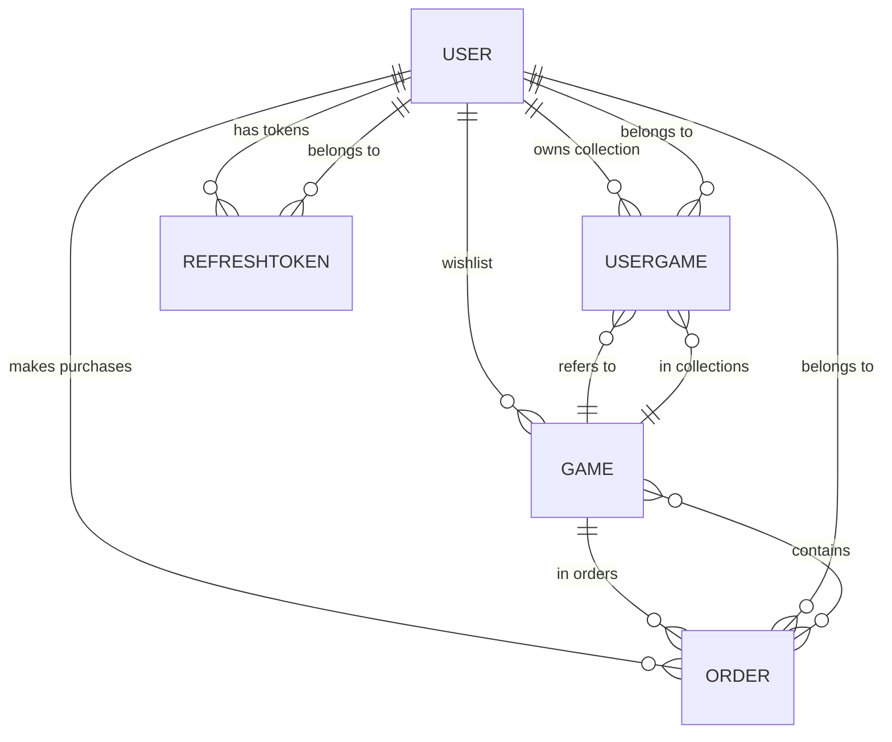

> [!NOTE] > **Punto Pivote**: La tabla `USERGAME` es el corazón de la "Colección". No duplicamos datos del juego; solo guardamos una referencia (`gameId`) y el estado de propiedad (`isOwned`, `playtime`). Esto mantiene la base de datos ligera.

---

## 🔐 Seguridad: Defensa en Profundidad

Aplicamos una estrategia de **"Defense in Depth"** con múltiples capas de protección:

### Nivel 1: Infraestructura (Hardening)

Protegemos el servidor antes de que la petición toque el código de negocio:

- **Helmet**: Configura cabeceras HTTP seguras (HSTS, No-Sniff, XSS Filter) para prevenir ataques comunes.
- **CORS**: Política estricta de orígenes (`credentials: true`) para evitar peticiones no autorizadas desde otros dominios.
- **Rate Limiting**: Protección contra fuerza bruta y DDoS, limitando el número de peticiones por IP en una ventana de tiempo.

### Nivel 2: Autenticación (Dual Token System)

Implementamos **JWT (JSON Web Tokens)** con rotación para equilibrar seguridad y UX.

#### Flujo 1: Login & Access

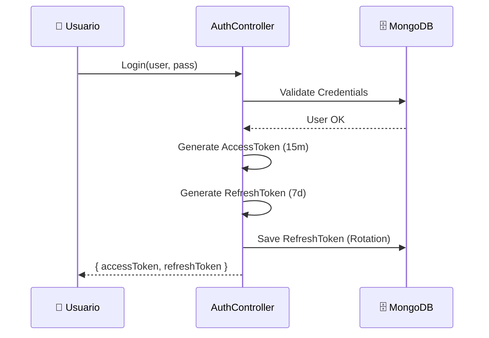

> [!TIP] > **¿Por qué es seguro?**
> Si un ladrón roba el **Access Token**, solo tiene 15 minutos de acceso. Si roba el **Refresh Token** e intenta usarlo, el sistema detectará que ese token ya fue usado (reuse detection) e invalidará **inmediatamente** todos los tokens del usuario legítimo, forzando un nuevo login seguro.

#### Flujo 2: Refresh Rotation (Antirrobo)

1. **Access Token (15 min)**: JWT firmado. Stateless.
2. **Refresh Token (7 días)**: Token opaco en DB. Stateful.

**Estrategia de Rotación**:
Cada uso del Refresh Token genera uno nuevo y borra el anterior. Esto permite detectar robos: si alguien intenta usar un token viejo, invalidamos toda la familia de tokens del usuario.

### Nivel 3: Datos y Validación

- **Input Validation (Zod)**: Actúa como un firewall de aplicación. Si el payload JSON no cumple el esquema estricto, la petición se rechaza antes de procesarse.
- **Password Hashing**: Usamos **Bcrypt** con salt rounds para asegurar que las contraseñas nunca se guarden en texto plano.

---

## 🔄 Flujo de Datos: "La Vida de una Petición"

Veamos paso a paso qué ocurre cuando creas un juego (`POST /api/games`) para entender cómo interactúan las capas.

### Diagrama de Secuencia (Middleware Chain)

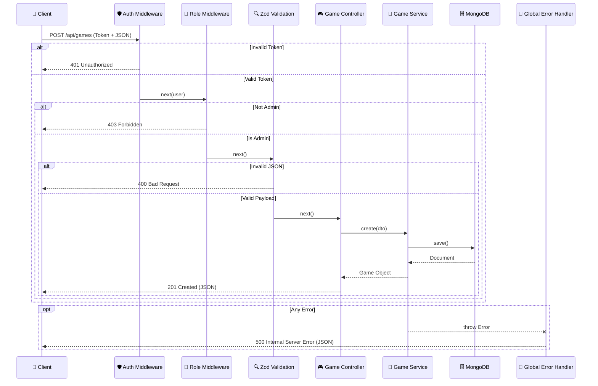

### Análisis Paso a Paso

1. **Request**: El Frontend envía el payload JSON y el Header `Authorization: Bearer <token>`.
2. **Middleware Chain**:
   - **Auth**: Descodifica el JWT. Si expiro, devuelve `401`. Si es válido, inyecta `req.user`.
   - **Role**: Verifica `req.user.role`. Si no es 'admin', corta el flujo con `403`.
   - **Validation**: Zod compara el `body` contra el esquema. Si falta un campo requerido, devuelve `400` con detalles.
3. **Controller**:
   - Recibe la petición **limpia y segura**.
   - Extrae los datos y delega al Servicio: `GameService.create(req.body)`.
4. **Service**:
   - Aplica lógica de negocio (ej: verificar si el título ya existe).
   - Llama al Modelo para persistir en DB.
5. **Error Handling (Catch-All)**:
   - Si la DB falla o el servicio lanza un error, **NO** enviamos el stack trace al usuario.
   - El `ErrorMiddleware` captura la excepción, loguea el error real (para devs) y devuelve un JSON estandarizado al cliente.

---

---

## 🌐 Estrategia de Integración (RAWG + Steam)

Para construir nuestro catálogo, utilizamos un enfoque híbrido conocido como **"Best Governing Source"**. No confiamos en una sola API para todos los datos, sino que combinamos lo mejor de cada proveedor.

### 1. Filosofía de "Source of Truth"

- **RAWG (Metadatos Estáticos)**: Es nuestra fuente para lo "visual" y descriptivo (Título, Descripción, Géneros, Screenshots).
  - _Razón_: Su base de datos es enorme y visualmente rica.
- **Steam (Datos Comerciales)**: Es nuestra fuente para lo "económico" (Precio, Moneda, Descuentos).
  - _Razón_: RAWG no tiene precios en tiempo real. Steam es la plataforma de venta real.

### 2. Algoritmo de Agregación (`AggregatorService`)

El proceso de importación no es una simple copia; es una construcción inteligente:

1. **Fetch Metadata**: Obtenemos el juego base de RAWG.
2. **Extract AppID**: Analizamos la lista de "stores" en la respuesta de RAWG buscar el enlace a Steam (ej: `store.steampowered.com/app/12345`).
3. **Fetch Price**: Usamos ese ID (`12345`) para consultar la API pública de Steam Store.
4. **Merge & Normalize**: Creamos un objeto `Game` unificado. Si Steam falla o no existe, el juego se crea "sin precio" (o precio 0), pero nunca descartamos los datos valiosos de RAWG.

### 3. Flujo Automático (Scripting & Seeding)

Más allá de la importación individual, disponemos de herramientas para poblar la base de datos masivamente:

1. **Herramienta de Importación (`src/scripts/import-pc-games.ts`)**:

   - Script de consola que orquesta la carga masiva.
   - **Lógica**: `RAWG Popular` -> `Filter Duplicates` -> `Enrich (Steam)` -> `Construct Schema`.
   - **Persistencia Dual**: Si se usa el flag `--commit`, guarda en MongoDB **Y** añade el registro a `data/games.json`.

2. **Estrategia de Seeds (`src/seeds/seed.ts`)**:
   - Usa `data/games.json` como "Source of Truth" persistente.
   - Permite restaurar o sincronizar la DB en cualquier entorno (`dev`, `prod`) ejecutando `npm run seed`.
   - Valida estrictamente los datos contra el Schema de Mongoose al insertar (`runValidators: true`).

---

## 🔄 Dynamic Flows: Procesos Críticos

### 1. Autenticación con Rotación

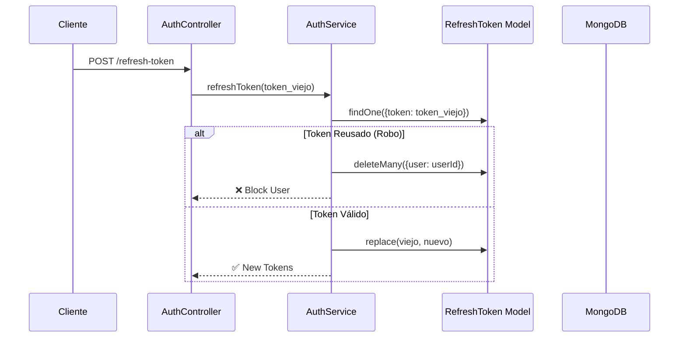

> [!TIP] > **¿Por qué es seguro?**
> Si un ladrón roba el **Access Token**, solo tiene 15 minutos de acceso. Si roba el **Refresh Token** e intenta usarlo, el sistema detectará que ese token ya fue usado (reuse detection) e invalidará **inmediatamente** todos los tokens del usuario legítimo, forzando un nuevo login seguro.

### 2. Compra y Activación

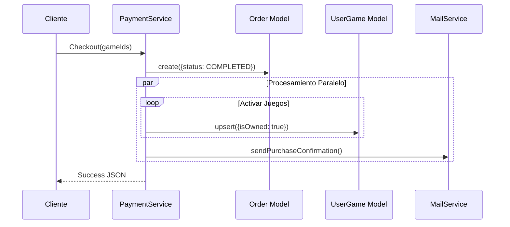

> [!IMPORTANT] > **Performance**: Usamos `Promise.all` (Parallel Processing) para activar los juegos y enviar el correo simultáneamente. El usuario recibe su respuesta "Success" sin tener que esperar a que el servidor SMTP termine de enviar el email.

### 3. Cascade Delete (Integridad)

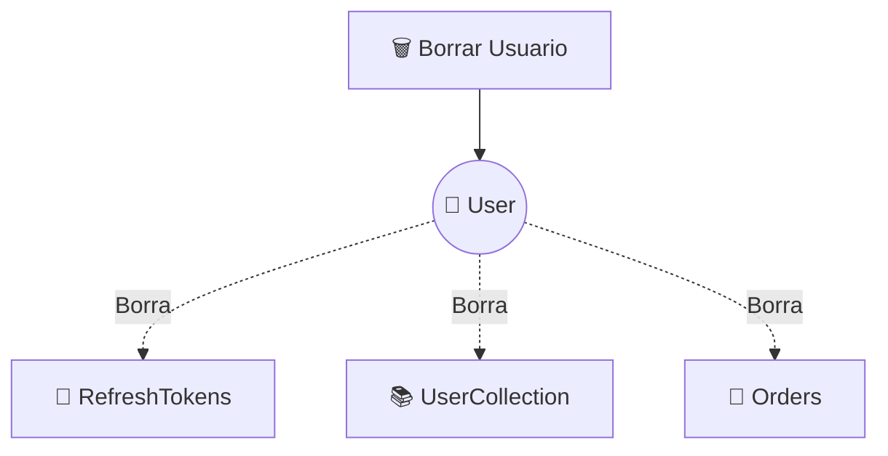

### 4. Importación y Agregación de Datos

Este flujo ilustra la estrategia "Dual-DataSource" para crear juegos:

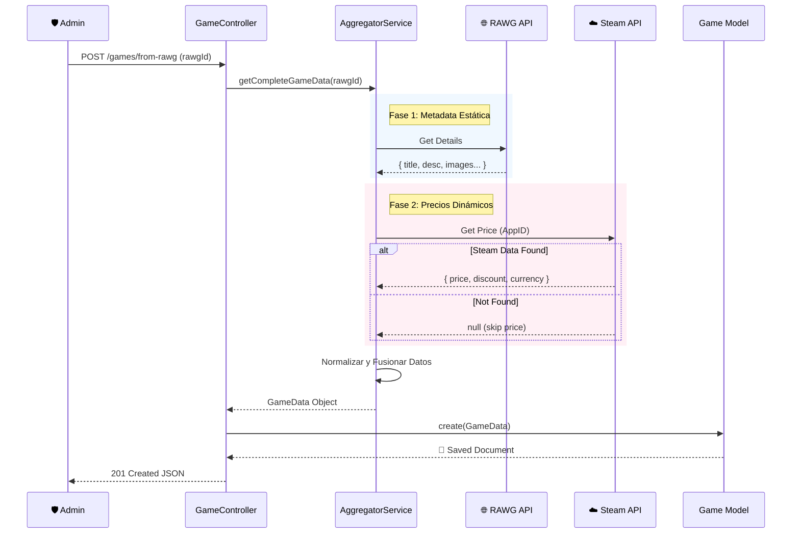

> [!NOTE] > **Integridad de Datos**: Al separar los datos en "Estáticos" (RAWG) y "Dinámicos" (Steam), obtenemos lo mejor de dos mundos: la belleza visual de RAWG y la precisión financiera de Steam, sin riesgo de sobrescribir datos críticos manualmente.

### 5. Búsqueda y Filtrado Avanzado

La lógica de búsqueda (`GameService.searchGames`) es un motor híbrido que combina:

1. **Weighted Text Search**: Usa índices de texto de MongoDB para buscar en Title (x10), Genre (x5), Developer (x3) y Publisher (x3).
2. **Query Builder Dinámico**: Construye filtros `$or` y `$and` al vuelo basados en los parámetros de la URL.
3. **Compound Sorting**: Siempre añade `_id` como criterio secundario para garantizar paginación determinista (`{ price: -1, _id: 1 }`).

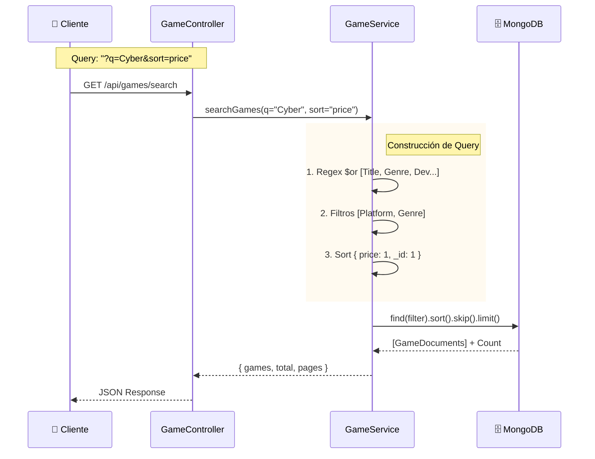

> [!TIP] > **UX Optimization**: El ordenamiento secundario por `_id` es crucial. Sin él, si dos juegos tienen el mismo precio, MongoDB podría devolverlos en orden aleatorio entre páginas, haciendo que el usuario vea duplicados o pierda juegos al navegar.

### 6. Pipeline de Agregación (Colecciones)

Para listar la colección del usuario (`GET /api/collection`) con filtros avanzados, evitamos hacer múltiples consultas. Usamos el poder de **MongoDB Aggregation Framework** para hacer "Joins" y filtrado en una sola pasada.

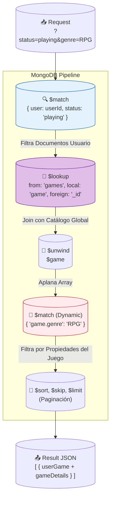

> [!NOTE] > **Eficiencia**: Al filtrar primero por `user` (Stage 1), reducimos drásticamente el set de datos antes de hacer el costoso `$lookup` (Stage 2). Si filtráramos por género antes, tendríamos que escanear toda la colección de juegos.

### 7. Motor de Descubrimiento (Unified Search)

Implementamos un motor de búsqueda híbrido **"Eager Sync"** en `DiscoveryService`. El objetivo es que el usuario encuentre juegos aunque no existan en nuestra DB local.

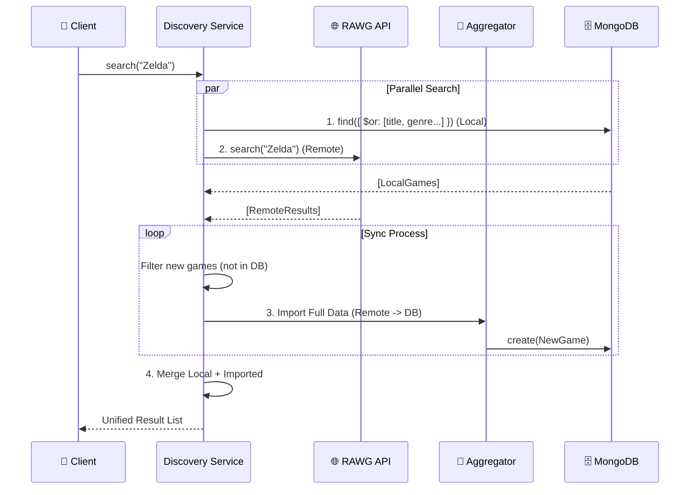

> [!TIP] > **Self-Healing Catalog**: Con cada búsqueda de usuario, nuestro catálogo local crece y "aprende". Si alguien busca "Elden Ring" y no lo tenemos, el sistema lo importa automáticamente en milisegundos y lo sirve en la misma respuesta. Las futuras búsquedas ya serán 100% locales y rápidas.

### 8. Analytics & Dashboard (Big Data Lite)

Para el Dashboard de Admin, no hacemos simples conteos. Usamos **Aggregation Pipelines** para extraer inteligencia financiera en tiempo real.

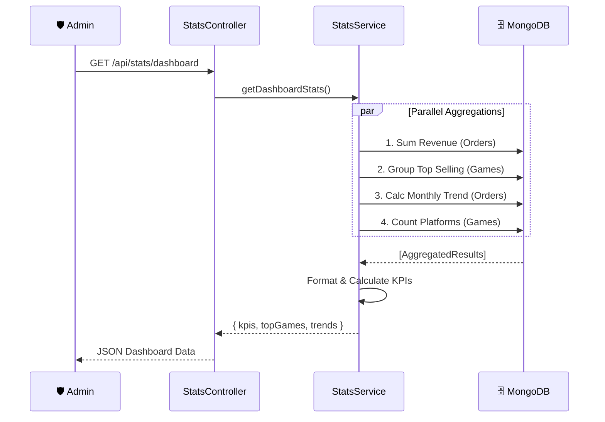

> [!NOTE] > **Eficiencia**: Usamos `Promise.all` para lanzar todas las agregaciones en paralelo. MongoDB es muy eficiente procesando estas queries analíticas.

---

## 🧪 Estrategia de Testing (Quality Assurance)

Garantizamos la estabilidad del sistema mediante una suite de tests exhaustiva (>85 tests, Jest + Supertest).

### 1. Global Setup (`tests/setup.ts`)

Gestiona el ciclo de vida de la conexión a MongoDB para todos los tests, evitando fugas de memoria y reduciendo boilerplate.

### 2. Tipos de Tests

- **Integración (Routes)**: Verifican el flujo completo desde el Request hasta la DB.
  - _Ejemplo_: `order.integration.test.ts` simula un usuario registrándose, logueándose, creando una orden y verificando su historial.
- **Unitarios (Services)**: Verifican la lógica de negocio aislada.
  - _Ejemplo_: `payment.service.test.ts` valida el cálculo de totales sin necesitar servidor HTTP.
- **Seguridad**: Tests específicos para roles, expiración de tokens, manejo de errores y validación de DTOs.

### 3. Coverage

Cubrimos todos los flujos críticos: Auth, Pagos, Catálogo y Colecciones.

---

## 📝 Estándares de Documentación

Seguimos estándares académicos estrictos (`PROMPT_AI.md`).

**Todos los archivos incluyen**:

1. **Cabecera de Archivo**:

   ```typescript
   /**
    * @file auth.service.ts
    * @description Handles authentication business logic
    */
   ```

2. **Comentarios de Función**:

   ```typescript
   /**
    * @param email - User email
    * @returns Auth tokens
    */
   ```

3. **Comentarios de Destino**:

   ```typescript
   // Destination: Used by AuthController.login
   export const login = ...
   ```

**Cumplimiento**: 100% de la codebase documentada bajo este estándar.

---

## 🚀 Requisitos de Entorno (Deployment)

Para desplegar la aplicación, las siguientes variables son obligatorias en `.env`:

| Variable             | Descripción               | Ejemplo                               |
| :------------------- | :------------------------ | :------------------------------------ |
| `PORT`               | Puerto del servidor       | `3500`                                |
| `DB_URI`             | Connection String MongoDB | `mongodb://localhost:27017/gamestore` |
| `JWT_ACCESS_SECRET`  | Firma para Access Tokens  | `secret_key_123`                      |
| `JWT_REFRESH_SECRET` | Firma para Refresh Tokens | `refresh_key_456`                     |
| `RAWG_API_KEY`       | Key para importar juegos  | `your_rawg_key`                       |
| `SMTP_HOST`          | Servidor de Correo        | `smtp.gmail.com`                      |
| `SMTP_USER`          | Usuario de Correo         | `user@gmail.com`                      |
| `SMTP_PASS`          | Contraseña de Aplicación  | `app_password_xyz`                    |

### Comandos Clave

- **Dev**: `npm run dev` (Hot Reload)
- **Build**: `npm run build` (Compila TS a JS en `/dist`)
- **Start**: `npm start` (Ejecuta `/dist/server.js`)
- **Seed**: `npm run seed` (Restaura DB desde JSON)
- **Test**: `npm test` (Ejecuta suite Jest)
