# Arquitectura del Frontend (Component-Based + Feature-Driven)

Este documento explica en profundidad cómo está construido el frontend, **por qué** se tomaron ciertas decisiones y cómo fluyen los datos a través del sistema React.

## 🏛️ Filosofía: Arquitectura Basada en Componentes + Features

El proyecto se organiza en **componentes reutilizables** y **features autocontenidos**. Cada pieza tiene una **responsabilidad única** y puede evolucionar independientemente.

**Principios clave**:

- **UI Components**: Piezas reutilizables (botones, tarjetas, inputs)
- **Features**: Módulos completos (autenticación, catálogo, carrito)
- **Hooks**: Lógica reutilizable
- **Services**: Capa de datos y comunicación con API

---

## 📊 Diagrama de Arquitectura (Vista General)

Este diagrama muestra la relación macro entre las capas del sistema.

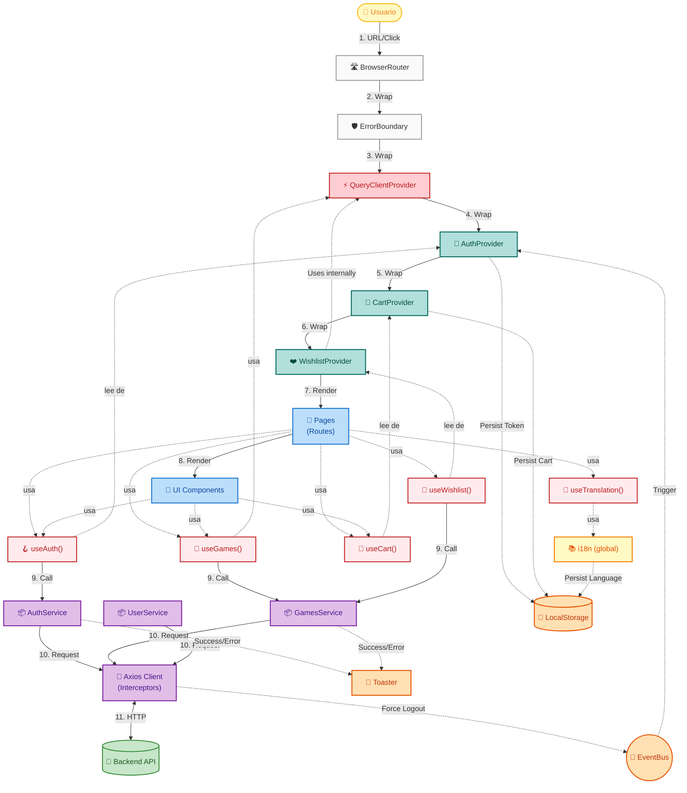

### 🎨 Leyenda del Diagrama

Este diagrama refleja la **composición real** de la aplicación React, no capas abstractas.

#### Colores por Tipo de Componente

| Color           | Componente / Responsabilidad | Ejemplo                                    |
| :-------------- | :--------------------------- | :----------------------------------------- |
| 🟨 **Amarillo** | **Usuario / i18n**           | Interacción externa, Traducciones globales |
| ⬜ **Gris**     | **Infraestructura**          | ErrorBoundary, Router                      |
| 🟩 **Verde**    | **Providers (Composition)**  | QueryClient, Auth, Cart, Wishlist          |
| 🟦 **Azul**     | **Components Tree**          | Pages, UI Components                       |
| 🟥 **Rojo**     | **Hooks (dentro de comps)**  | useAuth, useCart, useGames, useTranslation |
| 🟪 **Morado**   | **Services / API**           | auth.service, games.service, Axios         |
| 🟧 **Naranja**  | **Side Effects**             | LocalStorage, Toaster, EventBus            |

#### Flujo Principal Numerado

El diagrama muestra el flujo de datos con **11 pasos numerados**:

1. **Usuario interactúa** → Router
   2-7. **Provider Hierarchy** (Composition wrapping)
   - Router → ErrorBoundary → QueryProvider → AuthProvider → CartProvider → WishlistProvider → Pages
2. **Pages renderiza** Components
3. **Hooks llaman** Services (useAuth → AuthService, useGames → GamesService)
4. **Services hacen** Request (AuthService/GamesService → APIClient)
5. **APIClient** ↔ Backend (HTTP)

Las **líneas punteadas** (-.->)representan conexiones de lectura/uso sin transferencia de control:

- Components **usan** Hooks
- Hooks **leen de** Providers
- Providers **persisten en** Storage

### 📐 Vista Simplificada (Overview)

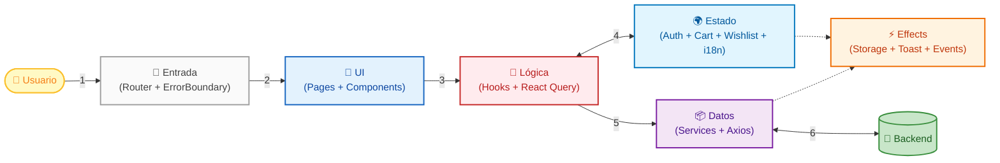

---

## 📂 Estructura del Proyecto

Visualización jerárquica de los componentes principales:

```text
src/
├── components/         # UI Reutilizable
│   ├── ui/             # Atoms (Button, Card, Input)
│   ├── layout/         # Estructura (Navbar, Footer)
│   └── ErrorBoundary.tsx
├── features/           # Módulos de Negocio (Vertical Slicing)
│   ├── auth/           # Login, Register, Session
│   ├── games/          # Catálogo, Detalles, Filtros
│   ├── collection/     # Biblioteca de Usuario
│   ├── wishlist/       # Lista de Deseos (Context)
│   ├── cart/           # Carrito de Compras
│   ├── checkout/       # Procesamiento de Pagos
│   └── profile/        # Avatar, Datos de Usuario
├── hooks/              # Global Hooks (useAdmin)
├── pages/              # Vistas Principales (Rutas)
├── services/           # Comunicación HTTP
│   ├── api.client.ts   # Axios Instance + Interceptors
│   ├── auth.service.ts # AuthService
│   └── games.service.ts
├── lib/                # Configuración (QueryClient, i18n)
├── routes/             # AppRoutes, ProtectedRoute
├── types/              # Definiciones TypeScript
└── utils/              # Helpers puros (Format, Error)
```

---

## 🧩 Componentes del Sistema (Capas Detalladas)

### 1. Configuración (`src/lib/`)

Aquí viven las configuraciones globales de la aplicación.

- **`queryClient.ts`**: Configura React Query con políticas de caché, reintento y refetch. **Estrategia**: Datos frescos por 5 minutos, caché por 30 minutos.
- **`i18n.ts`**: Configura internacionalización con i18next. Carga traducciones de inglés (`en`) y español (`es`) con persistencia en localStorage.

### 2. Features (`src/features/`)

Cada feature es un **módulo autocontenido** con todo lo necesario para funcionar:

- **`auth/`**: Autenticación y sesión
  - `AuthContext.tsx`: Context definition y `useAuth` hook para acceso al estado de autenticación
  - `AuthProvider.tsx`: Provider component que gestiona el estado global de autenticación
  - `pages/`: `LoginPage`, `RegisterPage`
  - `schemas.ts`: Validación con Zod
  - `types.ts`: Interfaces TypeScript
- **`games/`**: Catálogo de juegos
  - `hooks/`: `useGames` (infinite scroll), `useGameDetails`
  - `components/`: `GameCard`
- **`collection/`**: Biblioteca y wishlist
  - `hooks/`: `useLibrary`, `useWishlist` (Mutation hooks)
  - `services/`: usa `games.service.ts` (Library) y `user.service.ts` (Wishlist)
- **`wishlist/`**: Gestión de lista de deseos (Context-based)
  - `WishlistContext.tsx`: Context definition y `useWishlist` hook para acceso al estado de wishlist
  - `WishlistProvider.tsx`: Provider component con **optimistic updates** y React Query
  - Usado por `WishlistPage` para UX instantánea con rollback automático
- **`cart/`**: Carrito de compras
  - `CartContext.tsx`: Context definition y `useCart` hook para acceso al estado del carrito
  - `CartProvider.tsx`: Provider component con persistencia en localStorage
  - Gestión de items, cálculo de total y contador con `useMemo`
- **`checkout/`**: Proceso de compra
  - `hooks/`: `useCheckout`
  - `services/`: `checkout.service.ts`
- **`profile/`**: Gestión de perfil de usuario
  - `components/`: `AvatarUploadModal`, `ChangePasswordModal`, `EditProfileModal`
  - `hooks/`: `useUpdateProfile`

### 3. UI Components (`src/components/`)

Componentes reutilizables sin lógica de negocio:

- **`ui/`**: Componentes base
  - `Button.tsx`: Botón con variantes, tamaños y estado de carga animado (⏳)
  - `Card.tsx`: Contenedor con efecto glassmorphism
  - `Input.tsx`: Input de formulario con validación visual
  - `SearchBar.tsx`: Barra de búsqueda con navegación
  - `ImageModal.tsx`: Modal para galería de imágenes
  - `Loader.tsx`: Spinner de carga con tamaños configurables (sm/md/lg)
- **`layout/`**: Componentes de estructura
  - `MainLayout.tsx`: Layout principal con header/footer
  - `Navbar.tsx`: Navegación con menú móvil y glassmorphism
  - `UserDropdown.tsx`: Dropdown de perfil de usuario
- **`ErrorBoundary.tsx`**: Componente de manejo de errores
  - Captura errores de React en toda la aplicación
  - UI fallback amigable con glassmorphism
  - Botones de refresh y retry
- **`LanguageToggle.tsx`**: Selector de idioma (EN | ES)
  - Persistencia de preferencia de usuario
  - Integrado en Navbar (Desktop y Mobile)
- **`LazyImage.tsx`**: Componente de imagen optimizado
  - Carga diferida (`loading="lazy"`)
  - Skeleton loader animado durante la carga
  - Manejo de estado de error visual (placeholder)

### 4. Pages (`src/pages/`)

Componentes de página que orquestan features y UI:

- `Home.tsx`: Catálogo principal con infinite scroll
- `GameDetails.tsx`: Detalles de juego con compra/wishlist
- `LibraryPage.tsx`: Biblioteca del usuario
- `WishlistPage.tsx`: Lista de deseos del usuario con grid de juegos
- `CheckoutPage.tsx`: Proceso de pago
- `LandingPage.tsx`: Página de bienvenida
- `StorePage.tsx`: Página de tienda (placeholder "Coming Soon")
- `admin/`: Panel de administración

### 5. Services (`src/services/`)

Capa de comunicación con el backend. Cada servicio encapsula llamadas a la API:

- **`api.client.ts`**: Cliente Axios configurado con:
  - Base URL
  - Interceptores de request (añade token automáticamente)
  - Interceptores de response (maneja 401 con refresh token)
  - **Auto-refresh de tokens**: Detecta tokens expirados, refresca automáticamente y reintenta la petición
- **`auth.service.ts`**: Login, register, logout, getProfile, updateProfile, refreshToken
  - Gestiona tanto access token como refresh token
- **`games.service.ts`**: `getCatalog`, `getGameById`, `getMyLibrary`, `getFilters`
- **`checkout.service.ts`**: `purchaseGame`
- **`user.service.ts`**: `getWishlist`, `addToWishlist`, `removeFromWishlist` (utilizado por Context y Hooks)

### 6. Custom Hooks (`src/hooks/`)

Encapsulan lógica reutilizable con React Query:

- **`useGames`**: Infinite scroll con paginación
- **`useGameDetails`**: Fetch de detalles de un juego
- **`useLibrary`**: Biblioteca del usuario (solo si autenticado)
- **`useWishlist`**: Gestión de wishlist con mutations
- **`useCheckout`**: Proceso de compra
- **`useAdmin`**: Operaciones de administración

### 7. Routing (`src/routes/`)

- **`AppRoutes.tsx`**: Configuración de rutas con React Router v7
  - **Code Splitting (Lazy Loading)**:
    - Todas las páginas principales se importan con `React.lazy()`
    - Envueltas en `<Suspense fallback={<Loader />}>`
    - Vite genera chunks separados (`HomePage`, `GameDetails`, etc.) para reducir bundle inicial
  - **Estructura**:
    - Rutas públicas: `/`, `/home`, `/store`, `/catalog`, `/game/:id`
    - Rutas protegidas: `/library`, `/wishlist`, `/orders`, `/checkout/:id`
    - Rutas admin: `/admin/*`
  - Componente `ProtectedRoute` para control de acceso

### 8. Utilities (`src/utils/`)

Funciones helper sin dependencias de React:

- **`format.ts`**: Formateo de moneda con Intl.NumberFormat
- **`error.util.ts`**: Utilidades centralizadas de manejo de errores
  - `logger`: Logging condicional (solo en desarrollo)
  - `getErrorMessage()`: Extrae mensajes de error de forma segura
  - `handleApiError()`: Manejo estandarizado con toast + logging

---

## 🔄 Dynamic Flows: Flujos Clave de Lógica

Aquí desglosamos los flujos de datos más complejos e importantes de la aplicación.

### 1. Patrón de Context (2-File Pattern)

**Concepto**: Separación de Context definition y Provider implementation para Fast Refresh compliance.

A partir de Phase 16, todos los Contexts siguen este patrón:

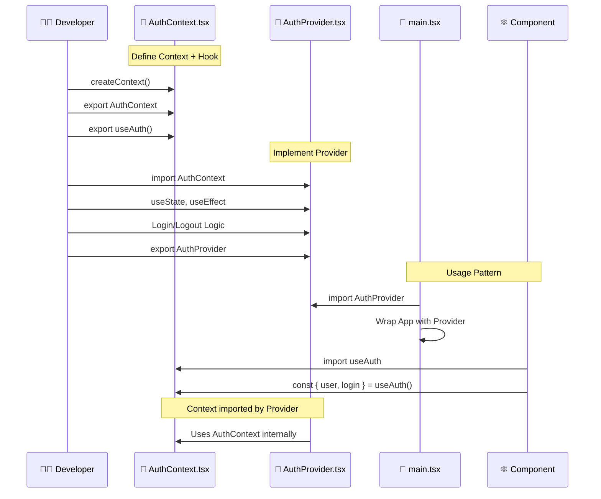

**Beneficios**:

1. **Fast Refresh**: Evita warnings `react-refresh/only-export-components`
2. **Separation of Concerns**: Context definition separada de implementación
3. **Mantenibilidad**: Archivos más pequeños (50-100 líneas vs 150-200)
4. **Claridad**: Responsabilidades bien definidas

**Estructura**:

```text
src/features/auth/
├── AuthContext.tsx      ← Context + useAuth hook (54 líneas)
└── AuthProvider.tsx     ← Provider component (127 líneas)
```

**Imports**:

```typescript
// En main.tsx (Provider)
import { AuthProvider } from "./features/auth/AuthProvider";

// En componentes (Hook)
import { useAuth } from "./features/auth/AuthContext";
```

### 2. Flujo de Autenticación (Dual Token)

**Concepto**: JWT con Access Token (corta duración) y Refresh Token (larga duración) con rotación automática.

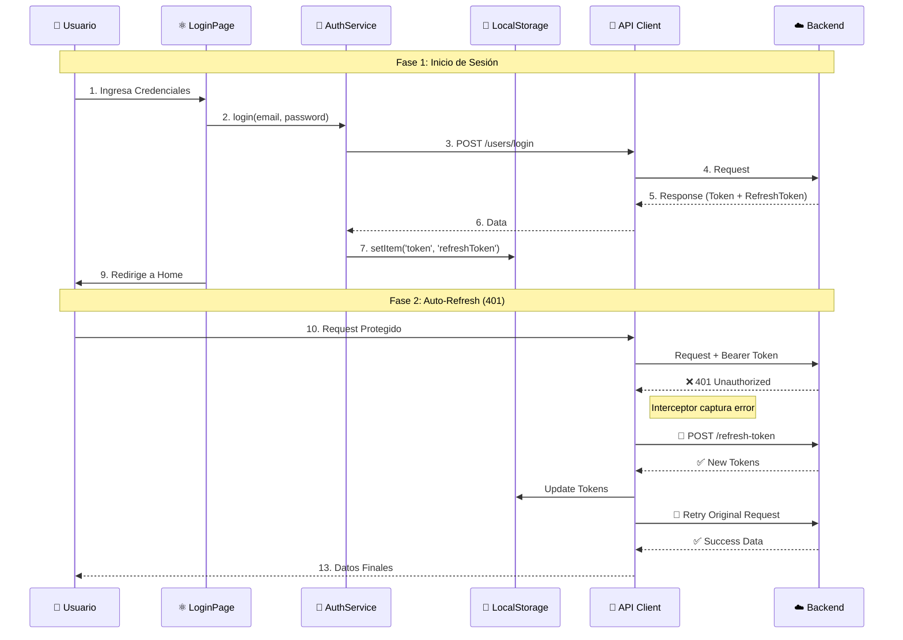

### 2. Flujo de Wishlist (Optimistic Updates)

**Concepto**: UX Perceptiva. La interfaz responde _antes_ que el servidor.

**Paso a paso textual**:

1. Usuario hace click en el botón ❤️.
2. `WishlistContext` actualiza el estado local inmediatamente -> ❤️ se rellena.
3. Se lanza la petición al servidor en segundo plano.
4. Si el servidor responde OK: Se muestra un Toast discreto.
5. Si el error falla: Se hace **rollback** automático del estado (❤️ se vacía) y se avisa al usuario.

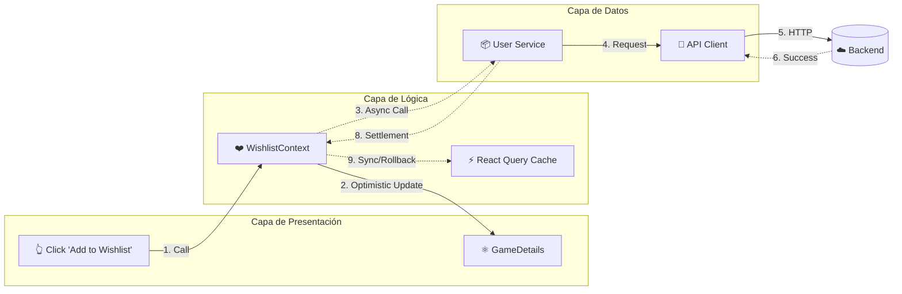

### 3. Flujo Checkout & Payment (Complejo de Negocio)

**Concepto**: Orquestación entre contextos y servicios transaccionales.

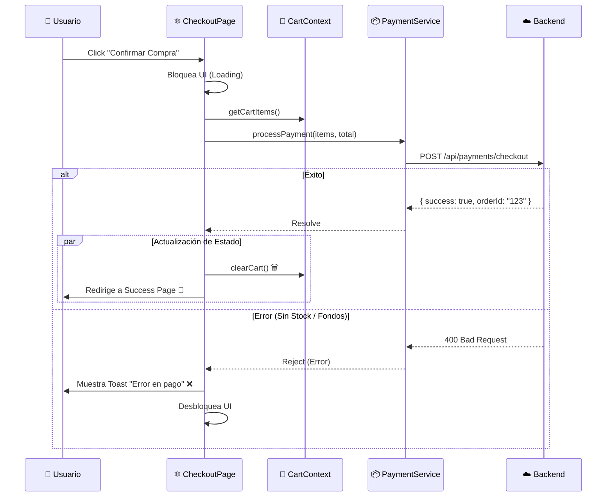

### 3.5. Flujo de Cart (Persistencia y Gestión de Estado)

**Concepto**: Carrito de compras con persistencia automática en localStorage y prevención de duplicados.

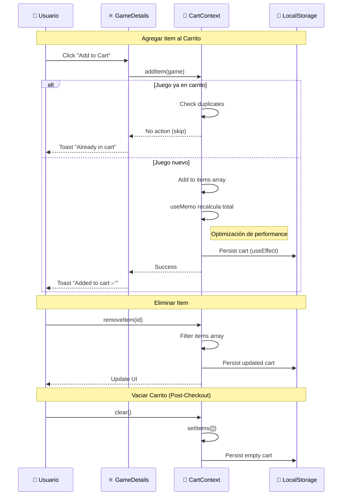

### 4. Flujo Upload de Avatar (Manejo de Archivos)

**Concepto**: Manejo de BLOBs y UX inmediata.

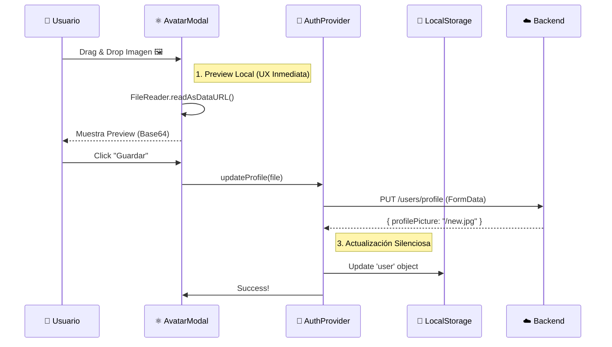

### 4.5. Flujo de Error Boundary (Manejo Global de Errores)

**Concepto**: Captura de errores de React para prevenir crashes completos de la aplicación.

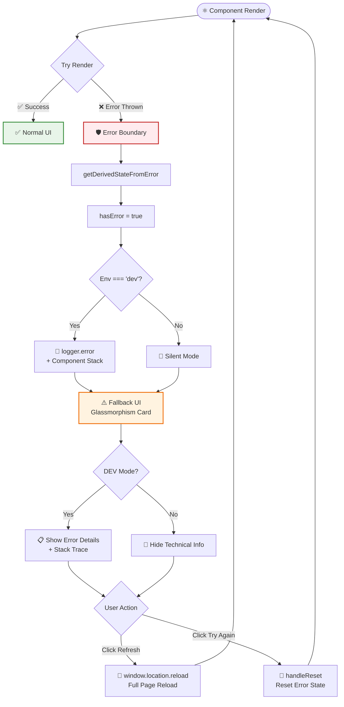

### 5. Flujo de Catálogo (Search & Filter)

**Concepto**: URL-Driven State. La URL es la "única fuente de verdad".

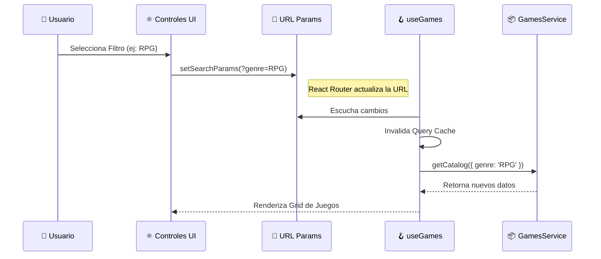

> [!TIP] > **Pagination Hooks Pattern**:
> Implementamos una separación estricta:
>
> 1.  **URL Hook** (`useCatalogUrl`): Maneja la escritura en URL.
> 2.  **Data Hook** (`useGames`): Lee la URL y hace fetch.
>
> El componente de UI **nunca** llama al servicio directamente; solo actualiza la URL.

### 6. Flujo de Protección de Rutas

**Concepto**: Guards en el lado del cliente (Client-Side Routing).

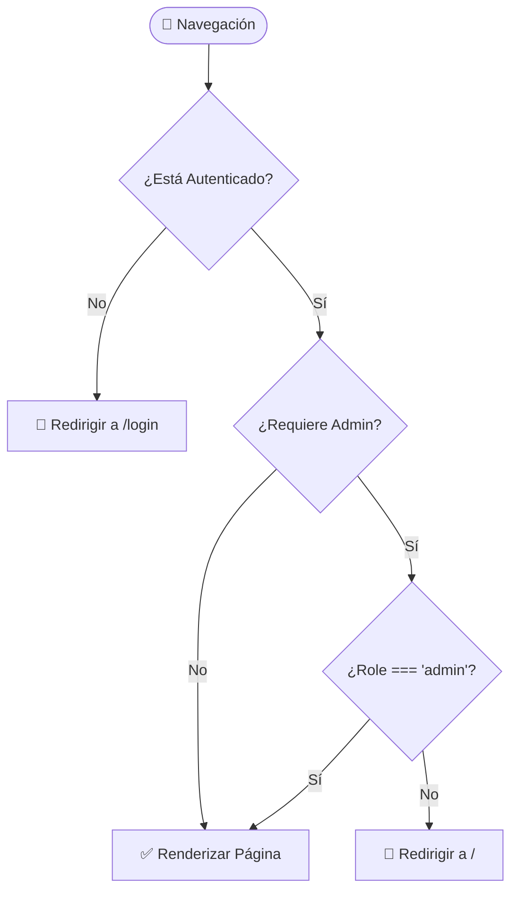

### 7. Flujo de Internacionalización (Language Toggle)

**Concepto**: Cambio de idioma con persistencia automática vía i18next.

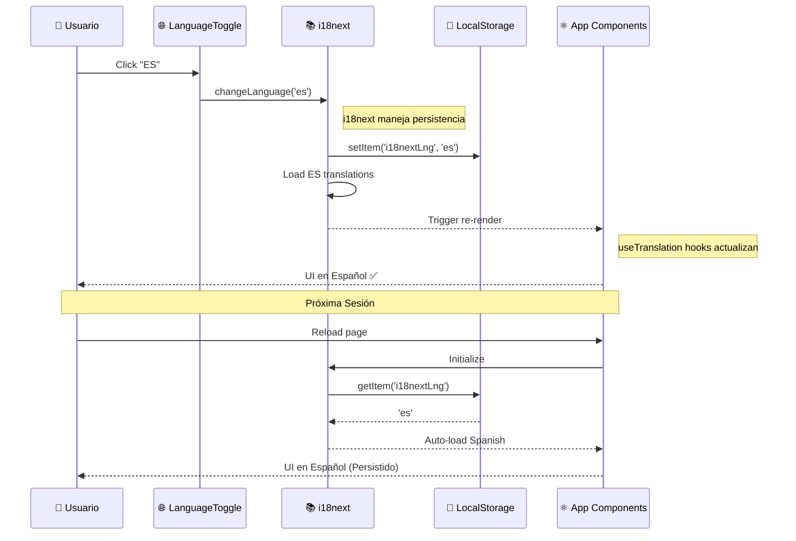

### 8. Flujo de Admin RAWG Import

**Concepto**: Importación de juegos desde RAWG API al catálogo local.

````mermaid
sequenceDiagram
    participant Admin as 👤 Admin
    participant UI as ⚛️ RAWGImport Page
    participant Hook as 🪝 useSearchRAWG
    participant Service as 📦 AdminService
    participant Backend as ☁️ Backend
    participant RAWG as 🎮 RAWG API
    participant DB as 💾 MongoDB

    Note over Admin, DB: Fase 1: Búsqueda
    Admin->>UI: Enter "Zelda"
    UI->>Hook: searchRAWG("Zelda")
    Hook->>Service: searchRAWG("Zelda")
    Service->>Backend: GET /admin/rawg/search?q=Zelda
    Backend->>RAWG: GET /games?search=Zelda
    RAWG-->>Backend: [Game1, Game2, ...]
    Backend-->>Service: Mapped games
    Service-->>Hook: Games array
    Hook-->>UI: Display results grid

    Note over Admin, DB: Fase 2: Importación
    Admin->>UI: Click "Import" (Game ID: 123)
    UI->>Hook: importGame(123)
    Hook->>Service: importFromRAWG(123)
    Service->>Backend: POST /admin/rawg/import/:id

    Backend->>RAWG: GET /games/123 (Full details)
    RAWG-->>Backend: Complete game data

### 9. Flujo de Navegación Zero-Latency (Prefetching)

**Concepto**: Anticipación a la intención del usuario para eliminar tiempos de carga.

```mermaid
sequenceDiagram
    participant User as 👤 Usuario
    participant Card as ⚛️ GameCard
    participant QC as ⚡ QueryClient (Cache)
    participant API as 🔧 API Client
    participant Detail as ⚛️ GameDetails

    User->>Card: Hover (Mouse Enter) 🖱️
    Card->>QC: prefetchQuery(['game', id])

    alt Datos ya en caché (StaleTime valid)
        QC-->>Card: Do nothing (Cache Hit)
    else Datos no existen o expirados
        QC->>API: Fetch details (Background)
        API->>QC: Store Data
    end

    User->>Card: Click (Navegar)
    Card->>Detail: Navigation to /game/:id

    Detail->>QC: useQuery(['game', id])
    Note right of QC: ¡Datos disponibles inmediatamente!
    QC-->>Detail: Return Data (Status: Success)
    Detail-->>User: Render Instantáneo (0ms Spinner)
````

    Backend->>Backend: Transform to local schema
    Backend->>DB: Save game document
    DB-->>Backend: Success

    Backend-->>Service: { success: true, game }
    Service-->>Hook: Invalidate ["games"] cache
    Hook-->>UI: Toast "Game imported ✅"
    UI-->>Admin: Refresh catalog

````

### 9. Flujo de Infinite Scroll (Paginación)

**Concepto**: Carga progresiva de juegos con `useInfiniteQuery`.

```mermaid
sequenceDiagram
    participant User as 👤 Usuario
    participant Home as ⚛️ HomePage
    participant Hook as 🪝 useGames
    participant Query as ⚡ React Query
    participant Service as 📦 GamesService
    participant Backend as ☁️ Backend

    Note over User, Backend: Carga Inicial
    User->>Home: Visit /home
    Home->>Hook: useGames()
    Hook->>Query: useInfiniteQuery
    Query->>Service: getCatalog({ page: 1 })
    Service->>Backend: GET /games?page=1&limit=12
    Backend-->>Service: { games: [...], hasMore: true }
    Service-->>Query: Cache page 1
    Query-->>Hook: { pages: [page1] }
    Hook-->>Home: Display 12 games

    Note over User, Backend: Load More
    User->>Home: Scroll to bottom / Click "Load More"
    Home->>Hook: fetchNextPage()
    Hook->>Query: getNextPageParam(lastPage)
    Query->>Service: getCatalog({ page: 2 })
    Service->>Backend: GET /games?page=2&limit=12
    Backend-->>Service: { games: [...], hasMore: true }
    Service-->>Query: Cache page 2
    Query-->>Hook: { pages: [page1, page2] }
    Hook-->>Home: Display 24 games total
````

### 10. Flujo de Profile Update

**Concepto**: Actualización de perfil con validación Zod y refresh de AuthContext.

```mermaid
sequenceDiagram
    participant User as 👤 Usuario
    participant Modal as ⚛️ EditProfileModal
    participant Hook as 🪝 useUpdateProfile
    participant Auth as 🔐 AuthProvider
    participant Service as 📦 AuthService
    participant Backend as ☁️ Backend

    User->>Modal: Edit username
    User->>Modal: Click "Save"

    Modal->>Modal: Zod validation
    alt Validation fails
        Modal-->>User: Show errors
    else Validation passes
        Modal->>Hook: updateProfile({ username })
        Hook->>Service: updateProfile(data)
        Service->>Backend: PUT /users/profile

        alt Success
            Backend-->>Service: { user: {...} }
            Service-->>Hook: Success
            Hook->>Auth: refreshUser()
            Auth->>Service: getProfile()
            Service->>Backend: GET /users/profile
            Backend-->>Service: Updated user
            Service-->>Auth: Update user state
            Auth-->>Modal: Context updated
            Modal-->>User: Toast "Profile updated ✅"
        else Error
            Backend-->>Service: 400 Error
            Service-->>Hook: Reject
            Hook-->>Modal: Error message
            Modal-->>User: Toast "Update failed ❌"
        end
    end
```

---

## 🎯 Arquitectura y Patrones de Diseño

Definimos nuestro estilo arquitectónico como **"Feature-Driven Modular Architecture with Component Composition"**.

Esta arquitectura se sostiene sobre **4 Pilares Fundamentales** que garantizan escalabilidad y mantenibilidad:

### 1. Feature-Driven Structure (Vertical Slicing)

En lugar de organizar el código por capas técnicas (horizontal), lo organizamos por **dominios de negocio** (vertical).

- **Antes**: Una carpeta gigante `/components` y otra `/pages`.
- **Ahora**: `/features/auth`, `/features/games`. Cada carpeta contiene _todo_ lo necesario para esa funcionalidad (sus componentes, sus hooks, sus servicios).
- **Beneficio**: Mantenibilidad extrema. Puedes borrar o refactorizar una feature sin miedo a romper otras partes del sistema.

### 2. Component Composition (LEGO Pattern)

Evitamos los "componentes monolíticos" (God Components). Construimos interfaces complejas ensamblando piezas pequeñas y reutilizables.

- **Patrón**: `GameDetailsPage` actúa como orquestador, ensamblando `<GameHero>`, `<GameInfo>` y `<PurchaseCard>`.
- **Beneficio**: Reutilización de código y tests unitarios más sencillos.

### 3. Separation of Concerns via Custom Hooks

Desacoplamos totalmente la UI de la Lógica.

- **Regla**: Los componentes visuales (JSX) **no deben** contener lógica de negocio compleja ni llamadas directas a la API.
- **Solución**: Custom Hooks (`useWishlist`, `useGames`) encapsulan el estado, efectos y llamadas a servicios.
- **Beneficio**: Te permite cambiar la implementación lógica (ej: migrar de Context a Redux) sin tocar una sola línea de la UI.

### 4. Strict Typing Strategy (Seguridad Tipada)

Desde la versión "Final Audit" (Diciembre 2025), implementamos **TypeScript Strict Mode** al 100%.

- **Zero `any` Policy**: El uso de `any` está prohibido y bloqueado por linters.
- **Shared Interfaces**: Los modelos de dominio (`Game`, `User`) se comparten via `src/types/*.ts`, asegurando que el frontend espera exactamente lo que el backend envía.
- **Partial Updates**: Usamos `Partial<T>` y `Pick<T>` (Utility Types) para formularios de edición, evitando la necesidad de crear interfaces duplicadas.

### 5. Validation Driven Development (VDD)

Siguiendo la metodología del backend, el frontend implementa **Scripts de Validación** para garantizar la integridad arquitectónica antes de cada hito.

- **Scripts**: `npm run validate:phaseX` (ej: `scripts/validate-phase16.js`).
- **Propósito**:
  1. **Static Analysis**: Verificar estructura de carpetas y nomenclatura.
  2. **Code Quality**: Escanear en busca de `console.log` olvidados o `any`.
  3. **Testing**: Ejecutar suites de test relevantes para la fase.
- **Beneficio**: "Compliance as Code". La arquitectura no es solo un documento, es una restricción ejecutable en el CI/CD pipeline.

### 6. Hybrid State Strategy (Pragmatismo)

No usamos una "bala de plata" para el estado. Usamos la herramienta correcta para cada necesidad:

- **Server State (Datos Asíncronos)** → **React Query** (Caché, revalidación, deduplicación).
- **Global Client State (Sesión)** → **Context API** (Auth, Theme).
- **Ephemeral UI State (Local)** → **useState** (Formularios, Modales).

---

## 🎨 Gestión del Estado (Resumen)

| Tipo de Estado   | Herramienta      | Ejemplo                   |
| :--------------- | :--------------- | :------------------------ |
| **Server State** | React Query      | Lista de juegos, Detalles |
| **Auth State**   | Context API      | Usuario, Tokens           |
| **UI State**     | useState / Props | Formularios, Pestañas     |

### 7. Styling Strategy (Clean Code)

- **CSS Modules**: Usamos `*.module.css` para estilos locales. **Zero Inline Styles**.
- **Variables CSS**: `index.css` define el sistema de diseño (colores, espacios) con variables.
- **Glassmorphism**: Estilo visual unificado mediante clases utilitarias y variables.

---

## 🔐 Seguridad y Autenticación (Detalle Técnico)

1. **Dual Token**:
   - **Access Token**: 15 min de vida. Se envía en header `Authorization`.
   - **Refresh Token**: 7 días de vida. Se usa solo para obtener nuevos access tokens.
2. **Protección de Rutas**:
   - Wrapper `<ProtectedRoute>` verifica existencia de token valido.
   - Prop `requireAdmin` verifica `user.role === 'admin'`.
3. **Auto-Refresh**:
   - Implementado via Axios Interceptors (`src/services/api.client.ts`).

---

### 8. Estrategias de Optimización y Rendimiento

Para garantizar una experiencia de usuario fluida, implementamos múltiples capas de optimización:

1.  **Code Splitting (Lazy Loading)**:

    - Uso de `React.lazy()` y `Suspense` en rutas principales.
    - Vite divide el bundle en chunks lógicos, reduciendo el TBT (Total Blocking Time) inicial.

2.  **Server State Caching (React Query)**:

    - `staleTime: 5 mins`: Evita refetching innecesario al navegar entre vistas.
    - `keepPreviousData: true`: Elimina el parpadeo (layout shift) durante la paginación.

3.  **Memoization Selectiva**:
    - `useMemo` en cálculos costosos del carrito (`totalAmount`, `totalItems`).
    - `useCallback` en handlers pasados a componentes puros para evitar re-renders.

---

## 🔮 Conclusiones y Evolución Futura

La arquitectura actual ha alcanzado un nivel de madurez alto, caracterizado por **estabilidad, tipado estricto y desacoplamiento**.

### Trabajo Futuro (Roadmap Académico)

1.  **Server-Side Rendering (SSR)**:
    - Migración potencial a **Next.js** para mejorar SEO y First Contentful Paint (FCP).
2.  **Testing End-to-End (E2E)**:
    - Implementación de **Playwright** para simular flujos de usuario completos en navegadores reales.
3.  **Documentation System**:
    - Integración de **Storybook** para documentar visualmente la biblioteca de componentes (Atomic Design).
4.  **PWA Capabilities**:
    - Service Workers para soporte offline básico y caché de activos estáticos.
